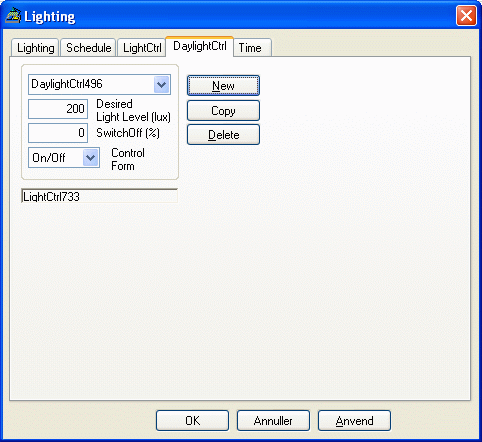

<link rel="stylesheet" href="../style.css">

# Belysning - Daylight Control

I lysreguleringen *DaylightCtrl* benyttes belysningsniveauet i referencepunktet som parameter for reguleringen. Til denne regulering benyttes parametrene *GeneralLighting* (kW) og *Gen.Lghting* (lux) fra *Lighting-systemet.*

Den første angiver den installerede effekt og den anden, hvilket belysningsniveau, som opnås, når almenbelysningen er tændt 100%. I *DaylightCtrl* angives hvilket belysningsniveau, der ønskes i referencepunktet inden for den tilhørende tidsangivelse. Hvis der fx ønskes 250 lux (*Desired Light Level*), kan det være nødvendigt at installere 6 armaturer, som måske tilsammen giver 280 lux (*Gen.Lighting*) i referencepunktet. Det er sjældent, at det er muligt at ramme præcis det ønskede niveau, og i øvrigt vil man normalt også installere lidt højere effekt fra starten for at tage hensyn til snavs og støv på armaturerne (vedligeholdelsesfaktor).

<figure id="center_img">

<figcaption>Dialog (Lighting | DaylightCtrl) til definition af reguleringen af solafskærmningen som en funktion af det beregnede belysningsniveau i et punkt i modellen.</figcaption>
</figure>

#### **Regulering efter dagslysmængden**

Ved denne reguleringstype reguleres almenlyset efter belysningsstyrken i et givet referencepunkt i zonen. Belysningsstyrken afhænger naturligvis meget af punktets placering, men normalt refereres der til belysningsstyrken på et vandret arbejdsplan 0,85 m over gulvet. I programmet bestemmes belysningsstyrken time for time ud fra det beregnede solindfald på vinduerne i zonen samt værdierne af sollysfaktorerne SF1, SF2 og SF3, defineret for hvert vindue samt sollysfaktorerne SF4, der er defineret for eventuelle solafskærmninger eller skodder, knyttet til vinduerne. [Sollysfaktorerne](https://bsim.outseta.com/support/kb/articles/49EdwkQ7/sollysfaktorer-for-windoors) er nærmere forklaret i [algoritmer til beregning af solstråling og dagslys](https://bsim.outseta.com/support/kb/articles/BWzdaPQE/algoritmer-til-beregning-af-solstraling-og-dagslys).

*Light Level* (lux) angiver den ønskede belysningsstyrke i det valgte referencepunkt. Hvis det beregnede dagslys giver den ønskede belysningsstyrke i punktet, antages almenlyset at være slukket. Hvis dette niveau ikke opnås ved dagslys alene, antages almenlyset at være tændt. Typen af lyskilde samt måden, almenlyset kan reguleres på, er bestemmende for, størrelsen af effekten, der optages.

*SwitchOff*: Angiver den procentvise effekt der optages i systemet når lyste er "slukket". Fungerer kun i forbindelse med kontinuert regulering.

*Control Form*: Dette felt er indgang til en valgmenu, hvori reguleringsmåden skal vælges. Der er mulighed for at vælge en on/off regulering, en trinvis i et specificeret antal trin, en kontinuert regulering samt en brugerdefineret type.

Ved denne reguleringstype reguleres almenlyset efter belysningsstyrken i et givet referencepunkt i zonen. Belysningsstyrken afhænger naturligvis meget af punktets placering, men normalt refereres der til belysningsstyrken på et vandret arbejdsplan 0,85 m over gulvet. I programmet bestemmes belysningsstyrken time for time ud fra det beregnede solindfald på vinduerne i zonen samt værdierne af sollysfaktorerne SF1, SF2 og SF3, defineret for hvert vindue samt [sollysfaktorerne](https://bsim.outseta.com/support/kb/articles/49EdwkQ7/sollysfaktorer-for-windoors) SF4, der er defineret for eventuelle solafskærmninger eller skodder, knyttet til vinduerne. Sollysfaktorerne er nærmere forklaret i [algoritmer til beregning af solstråling og dagslys](https://bsim.outseta.com/support/kb/articles/BWzdaPQE/algoritmer-til-beregning-af-solstraling-og-dagslys).

*Desired Light Level* (Lux) angiver den ønskede belysningsstyrke i det valgte referencepunkt. Hvis det beregnede dagslys giver den ønskede belysningsstyrke i punktet, antages almenlyset at være slukket. Hvis dette niveau ikke opnås ved dagslys alene, antages almenlyset at være tændt. Typen af lyskilde samt måden, almenlyset kan reguleres på, er bestemmende for, størrelsen af effekten, der optages.

Se også: [Light Control](https://bsim.outseta.com/support/kb/articles/j9b8aMmn/belysning---light-control)
