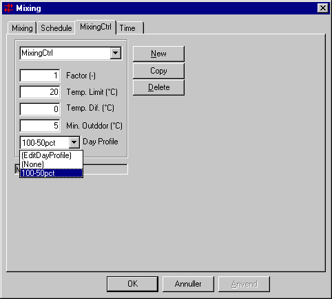

<link rel="stylesheet" href="../style.css">

# Mixing regulering

Reguleringen foretages i afhængighed af:

*   den operative temperatur i den aktuelle zone

*   forskellen i operativ temperatur i den aktuelle zone og zonen, som luften overføres fra

*   udetemperaturen

<figure id="center_img">

<figcaption>Dialog (Mixing | MixingCtrl) for definition af reguleringen for mixing.</figcaption>
</figure>

*Factor* angiver hvor stor en del af den nominelle luftstrømning (defineret på [fanebladet Mixing](https://help.bsim.dk/support/kb/articles/Rm8JEd94/mixing)) som er til rådighed inden for den tilhørende [tidsangivelse](https://help.bsim.dk/support/kb/articles/VmAOwo9a/tidsangivelse). Faktoren kan antage værdier mellem 1 og 0,01.

*Temp. Limit* angiver grænseværdien for lufttemperaturen i den aktuelle termiske zone.

*Temp. Dif.* betegner en forskel mellem den operative temperatur i den termiske zone eller, rum, som luften tages fra, og i den aktuelle termiske zone. *Temp. Dif.* kan værdien både være positiv og negativ.

*   Hvis den indlæste temperaturdifferens er 0, vil mixingen være aktiv inden for tidsangivelsen, hvis udetemperaturen er over *Min. Outdoor.*

*   En positiv værdi angiver, at der ønskes overført varme fra den tilstødende termiske zone eller rum til den aktuelle termiske zone. Mixing vil være aktiv inden for tidsangivelsen hvis lufttemperaturen i den termiske zone er lavere end *Temp. Limit + Temp. Dif.*

*   En negativ værdi angiver, at der ønskes 'overført kulde' fra den tilstødende termiske zone eller rum til den aktuelle termiske zone. Ved denne reguleringsform vil mixingen kunne fungere som 'natkøling' ved naturlig ventilation. Mixing vil være aktiv inden for tidsangivelsen hvis lufttemperaturen i dem termiske zone er højere end *Temp. Limit + Temp. Dif.*

*Min. Outdoor* angiver en grænseværdi af udetemperaturen. Mixingen vil kun være i funktion, såfremt udetemperaturen overstiger den indlæste værdi af *Min. Outdoor*. Ved valg af *Min. Outdoor* kan det fx sikres, at der ikke tilføres 'giverzonen' uønsket kold erstatningsluft (ved infiltration) for den luft, der afgives ved mixing. Værdien af *Min. Outdoor* har <u>**højest prioritet**</u> for regulering af mixingen. Ønskes en ubetinget mixing skal der således given en værdi af *Min. Outdoor* som er lavere end den laveste udetemperatur i det benyttede klimadatasæt.

*Day Profile* giver mulighed for at tilknytte et døgnprofil til reguleringen af mixingen så størrelsen af den mulige luftmængde kan varierer over døgnet. Indgangen *EditDayProfile* giver mulighed for at oprette nye eller redigere det valgte [døgnprofil](https://help.bsim.dk/support/kb/articles/L9PwDAQJ/dognprofil). Vælges der *None* i menuen tilknyttes der intet døgnprofil til mixingen, og luftmængden vil således alene være afhængig af de ovenfor nævnte parametre.

 