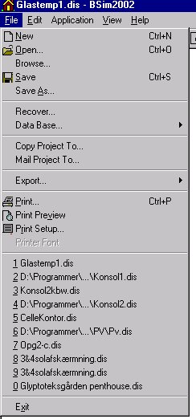

<link rel="stylesheet" href="../style.css">

# File

<figure id="center_img">

<figcaption>Menuen <u>F</u>ile (Alt-f).</figcaption>
</figure>

*   *<u>N</u>ew*: Starter [wizard'en](https://bsim.outseta.com/support/kb/articles/1Qpn73WE/chart-wizard) til oprettelse af en ny model. Der spørges, om den aktuelle model skal gemmes, inden der skiftes til oprettelse af den ny model.

*   *<u>O</u>pen* ...: Åbner dialog for åbning af eksisterende projekt.

*   *Browse*...: Åbner dialog for åbning af eksisterende projekt med preview af modellens geometri.

*   <u>S</u>*ave*: Gemmer modellen i det aktuelle navn. Der gemmes automatisk en backup-fil når denne funktion anvendes.

*   *Save <u>A</u>s* ...: Gemmer modellen under et nyt navn. Der gemmes automatisk en backup-fil når denne funktion anvendes.

*   *Recover*: Åbner en dialog, som giver mulighed for at åbne en [sikkerhedskopi](https://bsim.outseta.com/support/kb/articles/LmJv8EmP/options) af modellen, hvis programmet af en eller anden grund er gået ned.

*   *Data Base* ...: Giver mulighed for at vælge en ny standarddatabase samt at vælge en ny modeldatabase.

*   *Copy Project to* ... Opretter en kopi af det aktuelle projekt i en anden filmappe og evt. navn. Den rigtige database kopieres til samme filmappe som projektet.

*   Mail Project To... Åbner standardprogrammet til afsendelse af e-mail og vedhæfter den aktuelle model og database til e-mail'en. Databasefilen bliver automatisk omdøbt til *.disdb for at forhindre fjernelse af filen i e-mail systemet.

*   Export ...: (Når  ***SimView***  er aktiv):

    *   *Save As Radiance*: Gemmer modellens geometri samt eventuelle informationer om [overfladeegenskaber](https://help.bsim.dk/support/kb/articles/BWzdbgQE/simdb---buildingmaterial-finish) i en ekstern fil som kan læses ind i [Radiance](https://bsim.outseta.com/support/kb/articles/A93zY5Q0/eksport-af-data-til-radiance).

    *   *DirectX*: (fra BSim version 2002) Gemmer geometrien i en ekstern fil (*.x) der kan læses ind i et grafikprogram der understøtter [Direct-X](https://help.bsim.dk/support/kb/articles/7mawjM9E/visualisering-med-directx).

    *   *Bitmap*: Hvis 3D visningen er aktiv - venstreklik i i 3D visningen for at aktivere - kan en bitmap (*.bmp) grafik-fil af grafikken gemmes.

*   Export ...: (Når  ***tsbi5***  er aktiv):

    *   *Save Log As* ... (optræder kun når *tsbi5* | *Options* fanen er aktiv) gemmer resultaterne fra den seneste simulering under et nyt navn. Funktionen er særlig nyttig ved analyse af parametervariationer.

    *   *tsbi3* der kan gemme modellen i et format der kan læses ind i tsbi3-programmet.

    *   *Geometry* som gemmer geometrien (koordinater til alle flader) til brug for modelbeskrivelse i CFD-program.

    *   *CFD* (optræder kun når fanebladet Tables i tsbi5 er aktivt) som gemmer resultaterne af en *tsbi5*-simulering som randbetingelser til CFD-program.

    *   *Table* (optræder kun når *Table* er det aktive faneblad under tsbi5) gemmer resultaterne i tabelvisningen med de valgte parametre, begrænsninger (dag, uge, måned, total) og tidsfilter til en tabulatorsepareret tekstfil, som kan importeres i et regnearksprogram.

*   *Weather Data*: Når  ***tsbi5***  er aktiv optræder desuden en indgang til konvertering af klimadata for brug i simuleringerne med tsbi5:

    *   *Convert*: Åbner en dialog for [konvertering af klimadata](https://bsim.outseta.com/support/kb/articles/1Qpng0WE/konvertering-af-vejrdata-til-tsbi5) på ASCII (tekst) format til det binære format som benyttes i tsbi5.

    *   *ASHRAE*: (fra BSim version 2002) åbner en dialog for gratis hjemtagning af klimadata fra Internettet og automatisk konvertering.

*   *<u>P</u>rint*: Udskriver dokumentationen for modellen svarende til [*ModelList*](https://help.bsim.dk/support/kb/articles/ZmNr2Em2/simview---udskrift-af-model).

*   *Print Pre<u>v</u>iew*: Viser udskriften af *ModelList* på skærmen.

*   *P<u>r</u>int Setup* ...: Åbner en dialog for ændring af printer samt egenskaber for printeren.

*   *Printer Font*: Åbner en dialog for valg af skrifttype ved udskrift af *ModelList* på printer.

*   *<u>1</u>*, *<u>2</u>*, *<u>3</u>* og *<u>4</u>*: Navnene på de fire senest åbnede projekter. Et klik på et af navnene åbner projektet.

*   *E<u>x</u>it*: Afslutter *BSim*.
