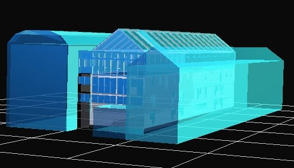

<link rel="stylesheet" href="../style.css">

# Visualisering med DirectX

Det er muligt at visualisere en BSim model med tredjeparts programmer der understøtter DirectX. Et eksempel på denne type programmer er Deep Exploration fra Right Hemisphere.

<figure id="center_img">

<figcaption>BSim model visualiseret med Deep Exploration.</figcaption>
</figure>

I denne visualisering er det muligt at vende og dreje modellen, påtrykke forskellige overfladeegenskaber og lyskilder, samt at gå ind i modellen.

 