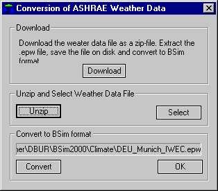

<link rel="stylesheet" href="../style.css">

# Energy+/ASHRAE klimadata

Det er muligt at hente og/eller konvertere klimadata i det format som benyttes af programmet EnergyPlus direkte i BSim fra version 2002. Disse klimadata er genereret af ASHRAE og stilles til rådighed for egen brug i forbindelse med simulering af energi og indeklima i bygninger. Betingelserne for at bruge disse klimadata kan ses på den Internet-side hvor de kan hentes, læses i de zip-arkiver hvor klimafilerne ligger eller ses her.

På siten findes klimadata fra mere end 800 lokaliteter i EnergyPlus format — 295 lokaliteter i USA, 55 i Canada, og mere end 450 lokaliteter i 93 lande over hele verden.

To betingelser skal være opfyldt for at benytte denne facilitet fuldt ud:

1.  Der skal være adgang til Internettet.

2.  I pc'ens registreringsdatabase skal der være defineret hvilket program, fx WinZip, der skal benyttes til åbning af zip-arkiver (*.zip).

Dialogen for hjemtagning og konvertering af klimadata i energy+ formatet (*.epw) er inddelt i afsnittene *Download, Unzip and Select* og *Convert*.

<figure id="center_img">

<figcaption>Dialog til automatisk hjemtagning og konvertering af klimadata i energy+ format.</figcaption>
</figure>

Download

*   Ved klik på *Download*-knappen åbnes den standard Internet browser som er konfigureret på pc'en på en Internet-side som indeholder link til amerikanske, canadiske og internationale klimafiler i energy+ format.

*   Gå til den klimafil som ønskes hentet og gem den til egen pc ved hjælp af kommandoerne i din Internet-browser. Når den eller de filer som ønskes er gemt på egen pc som *.epw eller *.zip filer, kan forbindelsen til Internettet afbrydes.

Unzip and Select

*   Hvis der er konfigureret et program, fx WinZip, til åbning af *.zip filer, og der er hentet en *.zip fil fra Internettet, kan udpakkeprogrammet kaldes ved tryk på *Unzip*-knappen. Det kaldte program bruges til at udpakke *.epw filen fra zip-arkivet i samme mappe som zip-arkivet er placeret i.

*   Når udpakningen er gennemført vil den udpakkede *.epw fil være valgt og vises i informationsfeltet øverst i afsnittet *Convert to BSim format*. Hvis filen ikke vises kan den vælges ved at trykke på *Select*-knappen. Denne knap skal også bruges hvis der er hentet en *.epw fil fra Internettet.

Convert to BSim format

*   De valgte klimadata konverteres til BSim's binære format ved tryk på *Convert*-knappen. Når konverteringen er gennemført vises et vindue med et sammendrag af de kilmadata som ligger i den konverterede fil. Vinduet lukkes ved tryk på krydset i øverste højre hjørne.

*   Konverteringen sker på samme måde som for den [manuelle konvertering](https://bsim.outseta.com/support/kb/articles/1Qpng0WE/konvertering-af-vejrdata-til-tsbi5) af klima filer til BSim's format. I samme mappe som klimafilen er placeret, opretter BSim en *.wdf (Weather Definition File), med den information som er nødvendig for at konvertere fra *.epw til *.dry formatet.

*   Dialogen forlades ved tryk på *OK*-knappen.

 