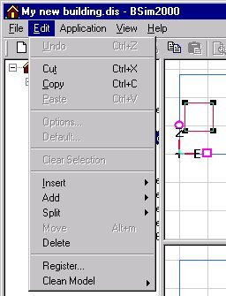

<link rel="stylesheet" href="../style.css">

# Edit

<figure id="center_img">

<figcaption>Menuen Edit (Alt-e).</figcaption>
</figure>

*   *<u>U</u>ndo*: Fortryder den seneste større ændring af modellens geometri.

*   *Cu<u>t</u>*: Klipper et element ud og lagrer det i pc'ens udklipsholder for senere indsættelse et andet sted. Denne funktion bør benyttes med forsigtighed.

*   *<u>C</u>opy*: Kopierer et objekt og lagrer det i pc'ens udklipsholder for senere indsættelse et andet sted. Denne funktion bør benyttes med forsigtighed.   
*<u>P</u>aste*: Indsætter indholdet af udklipsholderen.   
*Options*...: Åbner [dialogen](https://bsim.outseta.com/support/kb/articles/LmJv8EmP/options) for ændring af programmets indstillinger. Hvis tsbi5 er aktiv åbnes en [dialog for ændring af standardparametrene for tsbi5](https://bsim.outseta.com/support/kb/articles/EWBOvOmr/tsbi5-general-options).

*   *Default*...: Åbner en [dialog](https://bsim.outseta.com/support/kb/articles/y9gBKGQM/standardkonstruktioner) for tilknytning af standardkonstruktioner samt databasen hvorfra konstruktionerne vælges, ved at holde venstre knap på musen nede, medens konstruktionen trækkes til *Defaults* dialogen.

*   *Clear Selection*: Fravælger eventuelt valgte objekter i *SimView*.

*   *<u>I</u>nsert*: Giver mulighed for at indsætte følgende objekter i modellen:

    *   en eller flere bygninger fra et andet projekt. *Insert* | *Building* funktionen benyttes i forbindelse med definition af [skygger](https://bsim.outseta.com/support/kb/articles/E9LwJGQw/skygger-fra-omgivelser) fra omgivelserne eller ved import af flere etager fra CAD grundlag i [SimDXF](https://bsim.outseta.com/support/kb/articles/jW7oNkWq/cad-tegninger-som-grundlag-for-geometri).

    *   en WinDoor eller åbning i en valgt flade.

    *   en termisk zone (*Thermal Zone*),

    *   de standardkonstruktioner og materialer (*Defaults*)som er valgt for modellen.

*   *Add*: Giver mulighed for at tilføje objekter til modelgeometrien i SimView:

    *   en ny bygning (*Building*),

    *   et rum ([*Room*](https://help.bsim.dk/support/kb/articles/gWKDMlmp/simview---oprette-et-rum)) på den valgte flade,

    *   en flade (*Face*) mellem valgte vetrexes (hjørnepunkter) i fladen,

    *   en kant (*Edge*) mellem punkter i den valgte flade,

    *   en eller flere [WinDoor](https://help.bsim.dk/support/kb/articles/A93z8lQ0/tilfoje-abning-eller-windoor) i den valgte flade,

    *   en eller flere åbninger (*Opening*) i den valgte flade,

    *   et eller flere moduler ([*PvArray*](https://help.bsim.dk/support/kb/articles/E9LwrZQw/indsatte-solceller-i-modellen)) med solceller i den valgte flade (BSim udvidelsesmodul),

    *   en lokalitet (*Site*) til modellen.

*   *Split*: Åbner en dialog, der giver mulighed for at

    *   dele en kant (*Edge*) ved oprettelse af et punkt midt på kanten,

    *   dele en flade (*Face*) gennem valgte punkter (*vertex*) i fladen.

*   *Move*: Åbner en dialog for [flytning af en flade](https://help.bsim.dk/support/kb/articles/DmwA8o94/simview---move) parallelt med fladens normal.

*   *Delete*: Sletter et valgt objekt fra modellen.

*   *Register*: Registrerer *.DLL og *.OCX filer til brug for *BSim*. Normalt sker dette automatisk under installationen af programpakken.

*   *Clean Model*: Rydder op i modellen og fjerner overflødig information:

    *   *Model* fjerner overflødige objekter fra modellen, fx ubenyttede konstruktioner og reguleringer,

    *   *Geomerty* fjerner hjørnepunkter som ligger mindre end "*snap*" (se [Options](https://bsim.outseta.com/support/kb/articles/LmJv8EmP/options)) afstanden fra hinanden.
