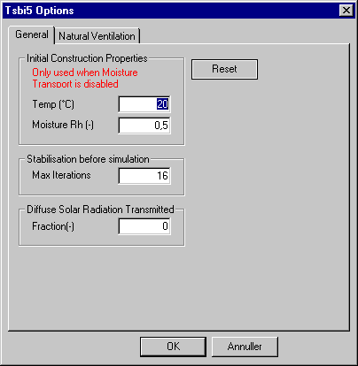

<link rel="stylesheet" href="../style.css">

# tsbi5 general options

**OBS:** Standardværdier bør **kun**  ændres med stor forsigtighed! Når der klikkes "OK" gemmes de aktuelle værdier og benyttes i **ALLE**  simuleringer indtil de ændres igen.

 

Reset

*   Ved klik på *Reset*-knappen skifter parametrene tilbede til standardværdierne som er indlejret i BSim.

<figure id="center_img">

<figcaption>Fanebladet General under tsbi5 options.</figcaption>
</figure>

Initial Construction Properties:

*   *Temp*: Temperaturen af alle lag i konstruktionerne ved starten af en simulering. Har betydning for den hastighed hvormed der opnås stabilitet inden den egentlige simulering starter.

*   *Moisture*: Fugtindholdet i alle lag i konstruktionerne ved starten af en simulering.

Stabilisation before simulation

*   *Max Iterations*: Indikerer med maksimale antal iterationer (dage) som gennemløbes for at opnå stabilitet inden start af den egentlige simulering. Simuleringen starter når [stabilitetskriteriet](https://help.bsim.dk/support/kb/articles/B9lwREQ8/stabilitetskriterie-for-indsvingning) for temperaturen eller det maksimale antal iterationer nås.

Diffuce Solar Radiation Transmittance

*   *Fraction*: Angiver andelen af diffus solstråling som kommer ind i en termisk zone gennem WinDoors der vender mod det fri og som kan transporteres videre til andre termiske zoner via indvendige WinDoors og åbninger. Hvis "0" (nul) gives vil den diffuse solstråling fordeles i forhold til arealet af det enkelte WinDoor/Opening sammenlignet med det totale indvendige vægareal.

