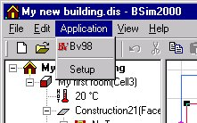

<link rel="stylesheet" href="../style.css">

# Application

<figure id="center_img">

<figcaption>Menuen Application (Alt-a).</figcaption>
</figure>

*   *Application navn(e)*: En liste med programmer som kan startes fra *BSim* med modellen som inddata.

*   *Setup*: Åbner en [dialog](https://help.bsim.dk/support/kb/articles/A93z61Q0/opsatning-af-applikationer) for valg af programmer, som ønskes at kunne starte direkte fra *BSim*. Programmerne optræder dels i menuen *Application* og dels som trykknapper på [værktøjsbjælken](https://help.bsim.dk/support/kb/articles/E9Lw5nQw/simview---varktojsbjalken) i gruppen umiddelbart til højre for *tsbi5*-ikonen.