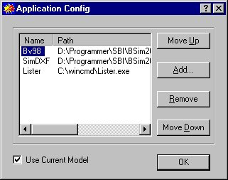

<link rel="stylesheet" href="../style.css">

# Opsætning af applikationer

Det er muligt at tilføje egne applikationer til BSims generelle [værktøjsbjælke]() gennem indgangen *Application* | *Setup*, som åbner følgende dialog.

<figure id="center_img">

<figcaption>Dialog (Application Config) for tilføjelse af programmer til BSim værktøjsbjælken.</figcaption>
</figure>

De programmer som defineres på denne måde vil blive kaldt når der trykkes på den tilkørende trykknap i værktøjsbjælken. Hvis der er sat en markering i for *Use Current Model* (nederst i dialogen) åbnes det valgte program med BSim modellen som inddata. Hvis der fx er valgt at *Notepad* skal vises på værktøjsbjælken, vil *Notepad* åbnes med BSim modellen som en tekstfil og modellen kan ødelægges ved uhensigtsmæssige ændringer.

I dialogen findes en række knapper med følgende funktion:

*   *Move <u>U</u>p* flytter den applikation som er markeret (Bv98 i figuren) en plads opad i rækkefølgen.

*   *<u>A</u>dd*... åbner en dialog hvor det program som ønskes tilføjet kan findes på pc'en.

*   *<u>R</u>emove* fjerner den markerede applikation fra listen.

*   *Move <u>D</u>own* flytter den applikation som er markeret (Bv98 i figuren) en plads nedad i rækkefølgen.

