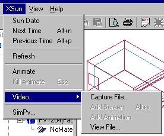

<link rel="stylesheet" href="../style.css">

# XSun

<figure id="center_img">

<figcaption>Menuen XSun er kun tilgængelig når XSun er aktiv.</figcaption>
</figure>

*   *Sun Date* Åbner en dialog til definition af datoen for analyse af det direkte solindfald i modellen.

*   *Next Time*: Skifter solens position et tidsstep frem (defineret i *Hour Step*) når en eventuel animation er standset - genvej: *Alt-n*

*   *Previous Time*: Skifter solens position et tidsstep tilbage (defineret i *Hour Step*) når en eventuel animation er standset - genvej: *Alt-p*

*   *Refresh* opdater den grafiske visning af modellen.

*   *Animate*: Starter en animation af den direkte solstrålings placering i modellen et tidsstep af gangen

*   *Kill animate*: Standser animationen af solens vandring i bygningen på det aktuelle tidspunkt - genvej: *Esc*.

*   *Video*: viser en under-menu med indgangene:

    *   *Capture File*: Åbner [dialog](https://bsim.outseta.com/support/kb/articles/zWZA419p/xsun-video) for valg af navn af den video som ønskes gemt af animationen af sol og skygger.

    *   *Add Screen*: Når der er valgt et navn til en video-fil kan det aktuelle still-billede gemmes i filen med denne kommando. Funktionen kan også aktiveres fra [XSun-menuen](https://bsim.outseta.com/support/kb/articles/j9b8Vwmn/xsun-menu).

    *   *Add Animation*: Når der er valgt et navn til en video-fil kan animationen startes og gemmes i filen med denne kommando. Funktionen kan også aktiveres fra [XSun-menuen](https://bsim.outseta.com/support/kb/articles/j9b8Vwmn/xsun-menu).

    *   *View File*: Åbner en dialog for valg og visning af video-fil.

*   *SimPV* (udvidelsesmodul) kalder en dialog hvor det er muligt at gennemføre en beregning af ydelsen fra et bygningsintegreret solcelleanlæg.
