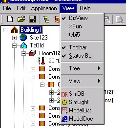

<link rel="stylesheet" href="../style.css">

# View

<figure id="center_img">

<figcaption>Menuen View (Alt-v).</figcaption>
</figure>

*   *DisView*: Skifter til visning af programfladen for [SimView](https://bsim.outseta.com/support/kb/articles/wQXx2xQK/simview) for modelredigering.

*   *XSun*: Skifte til visning af programfladen for [XSun](https://bsim.outseta.com/support/kb/articles/amRGdMQJ/analyse-af-solindfald-med-xsun) for beregning og visualisering af solindfald og skygger.

*   *tsbi5*: Skifter til visning af programfladen for [tsbi5](https://help.bsim.dk/support/kb/articles/ZmNrOwm2/termisk-simulering).

*   *Toolbar*: Viser eller skjuler [værktøjsbjælken](https://help.bsim.dk/support/kb/articles/E9Lw5nQw/simview---varktojsbjalken).

*   *Status Bar*: Viser eller skjuler statuslinjen (den brede bjælke nederst i programvinduet, som viser en kort forklaring på betydningen af den menuindgang, som er fremhævet).

*   *Tree*: Giver mulighed for at komprimere eller udvide visningen af modellen i træ-oversigten (til venstre i programvinduet) samt mulighed for tvungen opdatering af modelvisningen.

*   *View*: Giver adgang til en undermenu med følgende punkter:

    *   *Auto Scale*: Skalerer visningen automatisk.

    *   *Zoom In*: Zoomer ind på modellen (genvej: "+")

    *   *Zoom Out*: Zoomer ud, så modellen ses længere væk fra (genvej: "-").

    *   Viewpoint: Åbner en undermenu for ændring af den isometriske visning af modellen (genveje: pil-højre, pil-venstre, pil-op og pil-ned).

    *   Arrange: Arrangerer visningen inden for den definerede *Bounding Box*.

    *   *Expand*: Udvider det areal (grittet i 3D-grafikken) som vises.

    *   Collapse: Indskrænker det areal (grittet i 3D-grafikken) som vises.

    *   Update: Gennemfører en tvungen opdatering af modelvisningen.

*   SimDB: Kalder [databasen](https://bsim.outseta.com/support/kb/articles/y9q842QA/databasen-simdb) frem.

*   *SimLight*: Skifter til visning af programfladen for [SimLight](https://bsim.outseta.com/support/kb/articles/LmJvYAmP/dagslysberegninger-med-simlight).

*   *ModelList*: Skifter til visning af [modeldokumentationen](https://help.bsim.dk/support/kb/articles/ZmNr2Em2/simview---udskrift-af-model).

*   *ModelDoc*: [Viser modellen](https://bsim.outseta.com/support/kb/articles/jW7o0JWq/dokumentation-af-model) sorteret efter bygninger, termiske zoner, rum, flader, systemer, tidsangivelser osv.

 