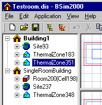

<link rel="stylesheet" href="../style.css">

# Termisk simulering

Den termiske simulering af bygningens *termiske zoner* foregår i programmet *tsbi5*. Simuleringen i *tsbi5* gennemføres for den aktuelle bygning (*CurrentBuilding*). Hvis der er flere bygninger ([skygger fra omgivelser](https://bsim.outseta.com/support/kb/articles/E9LwJGQw/skygger-fra-omgivelser)) i modellen er den aktuelle bygning markeret med fed skrift i træ-visningen.

<figure id="center_img">

<figcaption>Den aktuelle bygning markeres med fed skrift i træ-visningen.</figcaption>
</figure>

Den aktuelle bygning kan vælges/ændres ved, at højre-klikke på den bygning som skal være den aktuelle og markere i feltet *Current Building*. Ved denne handling fjernes samme markering fra den bygning som tidligere var den aktuelle bygning.

<figure id="center_img">

<figcaption>Building Property dialogen giver mulighed for valg af aktuel bygning.</figcaption>
</figure>

*tsbi5* er en Windows-baseret afløser for *tsbi3* med enkelte forbedringer og ændringer. I forhold til *tsbi3* er det især indførelsen af fuld 3D-geometri, der fremtræder som en markant ændring samt den grafiske visning af modellen. Desuden er der foretaget mindre ændringer i forbindelse med reguleringen af ventilationssystemer, og der kan beregnes et temperaturprofil op gennem et højt rum. Endelig er der via samspillet med [*XSun*](https://bsim.outseta.com/support/kb/articles/amRGdMQJ/analyse-af-solindfald-med-xsun)-programmet skabt mulighed for en mere nøjagtig beregning af solfordelingen i et rum.

Det vil med andre ord sige, at de fleste rutiner er identiske med *tsbi3*, hvorfor der henvises til dokumentationen herfor.

Simuleringsprogrammet startes ved tryk på ikonet for [*tsbi5*](https://bsim.outseta.com/support/kb/articles/A93z0lQ0/tsbi5).