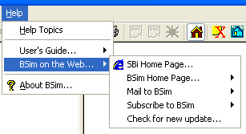

<link rel="stylesheet" href="../style.css">

# Help

<figure id="center_img">

<figcaption>Menuen Help (Alt-h).</figcaption>
</figure>

*   *Help Topics*: Åbner den valgte [standardhjælpetekst](https://bsim.outseta.com/support/kb/articles/LmJv8EmP/options) (dansk eller engelsk) med indholdsfortegnelsen i vinduet.

*   *Users Guide*: Åbner brugervejledningen som kompileret HTML-hjælpefil på dansk eller engelsk (hvis installeret).

*   *BSim on the Web* giver adgang til en undermenu hvor:

    *   *SBi Home Page* ... etablerer en Internetforbindelse til Statens Byggeforskningsinstituts hjemmeside.

    *   *BSim Home Page* ... etablerer en Internetforbindelse til *BSim's* hjemmeside på dansk eller engelsk.

    *   *Mail to BSim* ... åbner en almindelig e-mail dialog til *BSim* hvor det er muligt at stille [spørgsmål](https://help.bsim.dk/support/kb/articles/DmwABA94/sporgsmal-via-e-mail) om *BSim* og som sendes ud på en dansk eller engelsk fordelingsliste og distribueres automatisk til alle, som er tilmeldt listen. **NB**: Det er **kun** [medlemmer](https://help.bsim.dk/support/kb/articles/49664d9X/tilmelding-til-debatforum) der kan skrive til listen.

    *   *Subscribe BSim* ... åbner en almindelig e-mail dialog med den nødvendige tekst for at tilmelde afsenderens e-mail adresse til listen (dansk eller engelsk) for erfaringsudveksling (ovenstående) om *BSim*.

    *   *Check for new update* ... etablerer forbindelse til Internettet og checker om der findes en nyere version end den som i øjeblikket kører på pc'en. Findes der en nyere version på Internettet oplyses versionsnummeret. Der skal manuelt forbindes til BSim for at udføre opdateringen.

*   *About BSim*: Åbner en [dialog](https://bsim.outseta.com/support/kb/articles/VmAOk89a/about-bsim) med information om *BSim* (versionsnummer mv.), de tilknyttede moduler (DLL) samt et kort resume af systeminformationen for pc'en.