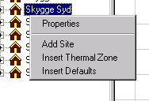

<link rel="stylesheet" href="../style.css">

# SimView - træ-menu

Ved højre-klik i træ strukturen til venstre i SimView kaldes en menu som giver adgang til kald af forskellige funktioner til redigering på globalt plan af modellen.

<figure id="center_img">

<figcaption>Menuen som vises ved højre-klik i træ-strukturen.</figcaption>
</figure>

Indgangene i menuen giver mulighed for at kalde funktionerne:

*   *Properties*, som er dialogen [Building Property](https://bsim.outseta.com/support/kb/articles/XQYde4mP/building-property) for den bygning i modellen som er den aktuelt valgte.

*   [*Add Site*](https://help.bsim.dk/support/kb/articles/dQG2Kom4/site-property), tilknytter en lokalitet (Site) til modellen.

*   [*Insert Thermal Zone*](https://help.bsim.dk/support/kb/articles/rm0x8ZmX/termisk-zone---egenskaber), som tilføjer en termisk zone til den aktuelle bygning i modellen hver gang funktionen kaldes.

*   [*Insert Defaults*](https://bsim.outseta.com/support/kb/articles/wQXxAZQK/insert-default-options): Åbner en dialog for overskrivning af standardværdierne for konstruktionerne med de værdier som aktuelt er valgt. Værdierne for standardkonstruktionerne kan ændres via *Defaults* fra [SimView-menuen](https://help.bsim.dk/support/kb/articles/49EdrJQ7/simview---menu).

 
