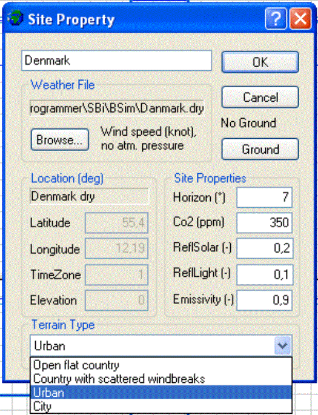

<link rel="stylesheet" href="../style.css">

# Site Property

Dialogen åbnes ved at højre klikke på Site ikonen  i træet. Hvis Site ikke findes kan det oprettes ved at højre-klikke på bygningen i træet og vælge "Add Site".

<figure id="center_img">

<figcaption>Site Property.</figcaption>
</figure>

*   *Weather file*: Viser stien til den valgte klimadatafil.

*   *Browse*: Åbner en dialog for valg af klimadatafil. Ved siden af *Browse*-knappen vises information om de valgte klimadata. Hvis der ikke er valgt en klimadatafil eller BSim ikke kan finde filen, åbner dialogen i mappen *Climate*, som er/skal være en undermappe til den mappe hvor BSim er installeret.

*   [Ground](https://help.bsim.dk/support/kb/articles/OW4NqGQg/jord-ground): Åbner en dialog for definition af den fiktive zone jord.

*   *Location* indeholder information, hentet fra klimadatafilen hvis en sådan er valgt, om placeringen af klimadata.

    *   *Latitude*: Viser breddegraden fra klimadatafilen **eller** giver mulighed for at vælge en breddegrad når der ikke er valgt en klimadatafil. Dette kan benyttes hvis kun skal foretages XSun beregninger.

    *   *Longitude*: Viser længdegraden fra klimadatafilen **eller** giver mulighed for at vælge en længdegrad når der ikke er valgt en klimadatafil. Dette kan benyttes hvis kun skal foretages XSun beregninger.

    *   *TimeZone*: Angiver hvor mange timer den aktuelle placering (klimadatafil) er placeret øst (positiv) eller vest (negativ) for Greenwich.

    *   *Elevation*: Viser højden over havet for den station hvor klimadata er målt.

*   *Site Proterties* indeholder forskellige standardværdier for siten som benyttes i simuleringerne med tsbi5.

    *   *Horizon*: Højdevinklen (vinklen mellem vandret og horisonten) for bygningen generelt.

    *   CO2 er indholdet af CO2 i udeluften (baggrundsniveau for simulering af CO2 i indeluften).

    *   *ReflSolar* er jordoverfladens reflektion af solstråling.

    *   *ReflLight* er jordoverfladens reflektion af dagslys.

    *   *Emmisivity* er jordoverfladens/omgivelsenes emmisivitet.

*   *Terrain Type* angiver hvor udsat bygningen er for vindpåvirkning. Informationen benyttes i forbindelse med [simulering af naturlig ventilation](https://bsim.outseta.com/support/kb/articles/49EdKkQ7/naturlig-ventilation) (udvidelsesmodul til BSim). Der kan vælges følgende terræntyper:

    *   Åbent, fladt land.

    *   Landskab med spredt bevoksning.

    *   Forstadsområder.

    *   Bycentrum.
