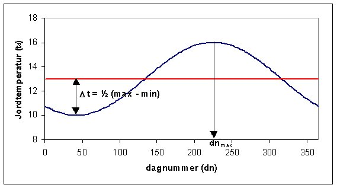

<link rel="stylesheet" href="../style.css">

# Jord (Ground)

*Dialogen kaldes fra [Site](https://bsim.outseta.com/support/kb/articles/dQG2Kom4/site-property) dialogen.*

 
Det er muligt at definere jordens maksimale temperatur og relative fugtindhold samt datoen for, hvornår dette indtræffer. Desuden kan den laveste jordtemperatur med tilhørende relative fugtindhold angives. På baggrund af dette påtrykkes en sinusformet variation af jordens temperatur og relative fugtighed over året.

<figure id="center_img">

<figcaption>Dialog (Ground) for oplysninger om jorden under bygningen.</figcaption>
</figure>

Årsvariationen af temperaturen i jorden beregnes som en middel døgntemperatur af:

$$ t_d = t_0 + \Delta t \cdot \left(\cos\left(\left(dn - dn_{max}\right) \cdot \left(\frac{2 \pi}{365}\right)\right)\right) $$

hvor
*   **t0** er årsmiddeltemperaturen,

*   **Δt** er den halve forskel mellem maksimum- og minimumtemperaturen,

*   **dn** er det aktuelle dagnummer,

*   **dnmax** er nummeret på den dag hvor temperaturen når sit maksimum (fx. svarer 10. august til dag nr. 222).

<figure id="center_img">

<figcaption>Årsvariationen af temperaturen i jorden eller et rum. Års middeltemperaturen er 13 °C. Svingningen er på 6°C (Maksimum - Minimum) med sit maksimum den 12. august (dagnummer 225).</figcaption>
</figure>

En tilsvarende variation af fugtindholdet i jordens, eller snarere fugtindholdet i den luft som kan hentes fra den fiktive zone jord, kan påtrykkes.

Der kan oprettes vilkårligt mange "Ground" i en model, og de kan benyttes som fiktive zoner imod vægflader hvor der ikke ønskes en detaljeret simulering af de termiske forhold på begge sider af en konstruktion.

I henhold til [DS418, tillæg 4](https://bsim.outseta.com/support/kb/articles/A93zbqQ0/litteratur), kan den dimensionerende jordtemperatur under opvarmede bygninger og i de dybereliggende jordlag omkring opvarmede bygninger fastsættes til 10 °C.

Terrændækkonstruktioner skal dog opbygges så en del af jordlaget under bygningen medregnes. Transmissionskoefficienten for et gulv eller en kældervæg direkte mod jord kan bestemmes af formlen:

$$ U' = \frac{1}{R_{si} + \sum R_m + R_j} $$

hvor

*   **Rsi** er overgangsisolansen ved den indvendige overflade i enheden m²K/W. Denne størrelse fremgår ikke af oplysningerne om konstruktionerne i visningen med [SimDB](https://help.bsim.dk/support/kb/articles/dQG2dzm4/simdb---buildingelement).

*   **Rm** er isolansen for materialelag i selve gulv- eller vægkonstruktionen i enheden m²K/W. Vises som en information i [SimDB](https://help.bsim.dk/support/kb/articles/dQG2dzm4/simdb---buildingelement).

*   **Rj** er en isolans af jorden i enheden m²K/W. Her kan en terrændækkonstruktion med fordel opbygges med et ekstra materialelag (jord) på ydersiden.

