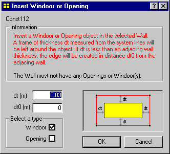

<link rel="stylesheet" href="../style.css">

# SimView - Insert Windoor

En WinDoor eller en åbning kan indsættes til udfyldning af en flade eller midt i den aktuelle flade med funktionen *Insert Windoor* fra SimView menuen. Denne funktion giver mulighed for hel udfyldning af en flade.

<figure id="center_img">

<figcaption>Dialog (Insert Windoor or Opening) for udfyldning af en flade med et WinDoor eller en åbning.</figcaption>
</figure>

*   *dt* er en afstand (m) - ens i alle retninger - fra kanten af fladen hvortil vinduet eller åbningen skal nå til. Der kan ikke opgives en dt mindre end 5 cm. Hvis der opgives en *dt* som er mindre end tykkelsen af de konstruktioner som afgrænser fladen, vil vinduet eller åbningen automatisk udfylde hele arealet mellem de tilgrænsende konstruktioner.

*   *dt0* er afstanden fra det nye WinDoor til overfladen af konstruktionerne i de tilstødende flader.

 

Se også:

*   [Options](https://bsim.outseta.com/support/kb/articles/LmJv8EmP/options)

*   [Defaults](https://bsim.outseta.com/support/kb/articles/y9gBKGQM/standardkonstruktioner)

*   [Add Building](https://help.bsim.dk/support/kb/articles/4966L49X/simview---oprette-en-bygning)

*   [Add Room](https://help.bsim.dk/support/kb/articles/gWKDMlmp/simview---oprette-et-rum)

*   [Add Face](https://help.bsim.dk/support/kb/articles/L9PwMrQJ/simview---redigere-modelgeometrien)

*   [Add Edge](https://help.bsim.dk/support/kb/articles/L9PwMrQJ/simview---redigere-modelgeometrien)

*   [Add Opening](https://help.bsim.dk/support/kb/articles/A93z8lQ0/tilfoje-abning-eller-windoor)

*   [Add WinDoors](https://help.bsim.dk/support/kb/articles/A93z8lQ0/tilfoje-abning-eller-windoor)

*   [Insert Windoor](https://help.bsim.dk/support/kb/articles/xmer2wQV/simview---insert-windoor)

*   [Move](https://help.bsim.dk/support/kb/articles/DmwA8o94/simview---move)

*   [Split Face](https://help.bsim.dk/support/kb/articles/L9PwMrQJ/simview---redigere-modelgeometrien)

*   [Split Edge](https://help.bsim.dk/support/kb/articles/L9PwMrQJ/simview---redigere-modelgeometrien)