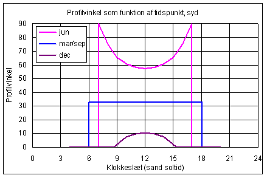
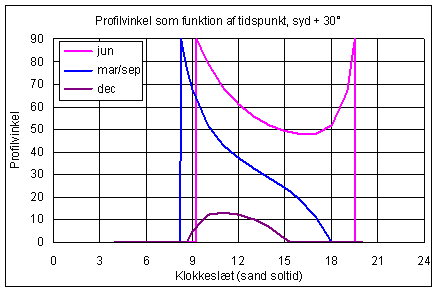
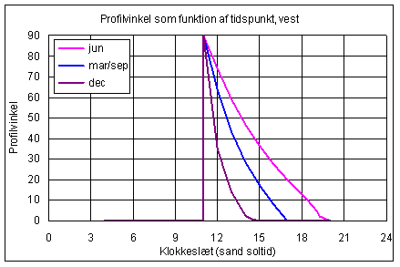

<link rel="stylesheet" href="../style.css">

# Profilvinkel

Da strålingens indfaldsvinkel afhænger af både solhøjde og azimut opererer man med den såkaldte profilvinkel Θ defineret som indfaldsvinklen projiceret ind på et vertikalt normalplan til den aktuelle flade. Profilvinklen kan beregnes ud fra solhøjden og forskellen mellem solens og væggens azimut:

$$ \theta = \tan^{-1} \left( \frac{\tan h}{\cos \gamma} \right) $$

hvor

*   Θ er profilvinklen

*   h er solhøjden

*   γ er solens azimut minus væggens azimut

På er profilvinklen som funktion af tidspunktet på dagen vist ved forskellige orienteringer af vinduet og for forskellige måneder (den 21. i månederne). Det ses fx, at for orienteringen syd er profilvinklen konstant hele døgnet ved forårs- og efterårsjævndøgn, den 21. marts og 21. september.

<figure id="center_img">

<figcaption></figcaption>
</figure>

<figure id="center_img">

<figcaption></figcaption>
</figure>

<figure id="center_img">

<figcaption></figcaption>
</figure>

*Eksempler på beregnet profilvinklens variation over dagen og året ved forskellige orienteringer. Kurverne er optegnet for den 21. i de viste måneder.*
