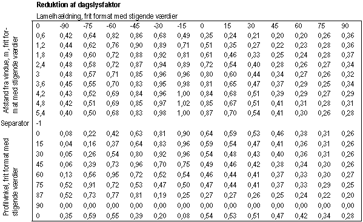

<link rel="stylesheet" href="../style.css">

# Standardtabeller for lamel-afskærmninger

I tidligere versioner af BSim programpakken var beskrivelsen af en solafskærmning begrænset til angivelse af en fast afskærmningsfaktor. I den seneste version af BSim er implementeret nye modeller for solafskærmninger, hvor afskærmningsfaktoren kan variere, både efter afskærmningens indstilling (fx lamelhældning på en persienne) og efter tiden på dagen og året. Solens position på himlen i forhold til en given facadeorientering kan beskrives ved profilvinklen, som er solhøjdens projektion på et lodret plan vinkelret på facaden. For hver time i året, som simuleres med BSim, beregnes profilvinklen og herudfra kan man beregne hvordan afskærmningsfaktoren eller g-værdien (den totale solvarmetransmittans) for det samlede system varierer henover dagen og året. Det bemærkes, at mens g-værdien i datablade for ruder og afskærmninger normalt kun angives for stråling vinkelret på ruden, så er den her angivet for enhver indfaldsvinkel af den direkte stråling, ligesom den også angives for diffus stråling.

### **Anvendelse af bruger-definerede tabelværdier**

BSim kan regne på almindelige persienner, placeret udvendigt eller indvendigt, idet der er indlagt tabeller for afskærmningsfaktor (g-værdi) for persienner med forskellig reflektans. Det forudsættes, at persiennen anvendes i kombination med en energirude. For at kunne regne på andre typer af lamel-baserede afskærmninger, fx glaslameller, er der implementeret en mulighed for at brugeren selv kan definere en lamelbaseret afskærmnings egenskaber gennem en tabel. Tabellen skal indeholde g-værdi som funktion af lamelhældning og profilvinkel samt en reduktionsfaktor for dagslys som funktion af lamelhældningen (overskyet vejr). Formatet for tabellen er vist i nedenstående figur.

<figure id="center_img">

<figcaption>Aktuel solvarmetransmittans for afskærmning (i kombination med den aktuelle rude).</figcaption>
</figure>

Beskrivelse af brugerdefinerede tabeller til regulering af lamelbaserede solafskærmninger i BSim. Reguleringen er af typen BlindCtrl. Tabellen laves som en ren tekstfil hvor kolonnerne er separeret af mellemrum eller tabuleringer. Kun tallene inden for den viste ramme må indgå i tabellen.