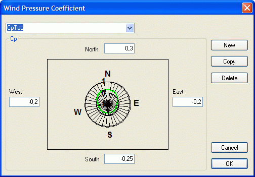

<link rel="stylesheet" href="../style.css">

# Vindtrykkoefficient for spalter

Benyttes til simulering af ventilerede konstruktioner og den eventuelle transport af luft (jævnt fordelt infiltration) ved diffusion gennem konstruktionen.

<figure id="center_img">

<figcaption>Dialog for definition af tryktabskoefficienter to top og bund af en lodret, ventileret luftspalte i en konstruktion.</figcaption>
</figure>

Der skal angives fire tryktabskoefficienter, en for hver af de fire hovedkompasretninger, for åbningen i toppen og i bunden af en lodret, ventileret luftspalte i en konstruktion der vender imod det fri. Der benyttes et standard udtryk til beregning af tryktabskoefficienten (angivet ved den grønne linie på grafen) for en vilkårlig vindretning.
