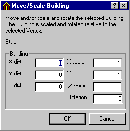

<link rel="stylesheet" href="../style.css">

# Move: Bygninger

En bygning i modellen kan flyttes i forhold til det globale koordinatsystem ved, at vælge bygningen i træstrukturen og derefter indgangen *Move* fra [*SimView*-menuen](). Herved vises en dialog som giver mulighed for at flytte bygningen et antal meter i hver af de 3 akseretninger.

<figure id="center_img">

<figcaption>Dialog (Move/Scale Building) til flytning af en bygning i modellen.</figcaption>
</figure>

Hvis der <u>inden</u> flytningen er valgt et hjørnepunkt (shift+klik eller dobbelt-klik) i en af bygningens flader, vil inddatafelterne til højre i dialogen være aktive. Det giver mulighed for at ændre bygningens proportioner (skaleringen) i de 3 akseretninger, samt at rotere bygningen om en lodret akse gennem det valgte hjørnepunkt. *Ved ændring af skaleringen vil værdierne for alle hjørnepunkter i den aktuelle akseretninge blive ganget med skaleringsværdien*.
