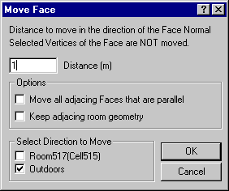

<link rel="stylesheet" href="../style.css">

# Move: Flader

Flader kan flyttes i retninger parallelt med fladens normalvektor. Det er muligt, at flytte den valgte flade alene eller alle flader som er parallelle med fladen og ligger i samme plan.

En flade kan først flyttes når den er valgt. En valgt flade angives med rød streg i 3D-visningen.

<figure id="center_img">

<figcaption>SimView - Move Face dialogen bruges til at flytte flader parallelt med fladens normal.</figcaption>
</figure>

*   *Distance* angiver hvor mange meter (positivt tal) fladen skal flyttes

*   *Options* giver mulighed for at vælge hvordan flytningen skal influere på de tilstødende rum:

    *   Ved at sætte hak ud for "*Move all adjacing Faces that are parallel*" vil modellens øvrige flader som har en normalvektor parallel med fladens normalvektor **og** ligger i samme plan som den aktuelle flade skal flyttes sammen med fladen.

    *   Et hak ud for "*Keep adjacing room geometry*" sikrer at de tilstødende rum bevarer deres geometri.

    *   Ved at fjerne **begge** hak **og** vælge et eller flere hjørnepunkter inden flytningen er det muligt at flytte fladens øvrige hjørnepunkter i den ønskede retning og på denne måde skabe en skrå flade.

*   Retningen for flytningen vælges under *Select Direction to Move*. Her kan vælges mellem de to rum som ligger på hver side af fladen, i eksemplet *Room0* og udeluften (*Outdoors*).
