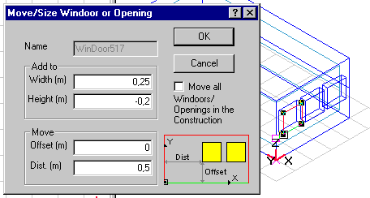

<link rel="stylesheet" href="../style.css">

# Move: WinDoor

WinDoor kan flyttes inden for den flade den tilhører.

En WinDoor kan først flyttes når den er valgt (markeret med rødt i 3D-visningen) og der er udpeget et lokalt koordinatsystem, som WinDoor skal flyttes i. Det lokale koordinatsystem (et nulpunkt og en akse) kan fx vælges i et hjørne af WinDoor. Et valgt (dobbelt-klik i 3D-visningen) nulpunkt markeres med en ramme omkring et hjørnepunkt og en valgt (dobbelt-klik i 3D-visningen) akse med grøn farve.

<figure id="center_img">

<figcaption>Dialog (Move/Size Windoor or Opening) til flytning af WinDoor.</figcaption>
</figure>

I de to grupper af information i dialogen er det muligt, dels at ændre størrelsen af den valgte WinDoor (*Add to*) og dels at flytte WinDoor inden for fladen (*Move*). I alle felter kan der gives både positive og negative værdier.

*   *Add to Width* giver mulighed for at ændre bredden af WinDoor. Den nye bredde afsættes ud fra nulpunktet i det lokale koordinatsystem.

*   *Add to Height* ændrer højden af WinDoor.

*   *Move Offset* flytter WinDoor WinDoor parallelt med y-aksen.

*   *Move Dist.* flytter WinDoor parallelt med x-aksen.

*   Ved afkrydsning i *Move all Windoors/Openings in the Construction* vil alle WinDoors som tilhører den samme flade som den aktuelle blive flyttet samtidig med den aktuelle WinDoor.

Eksemplet i figuren angiver en forøgelse af bredden med 0,25 m, en reduktion af højden med 0,2 m. Bunden bibeholdes i samme højde over gulvet, men WInDoor flyttes 0,5 meter i samme retning som x-aksen.
