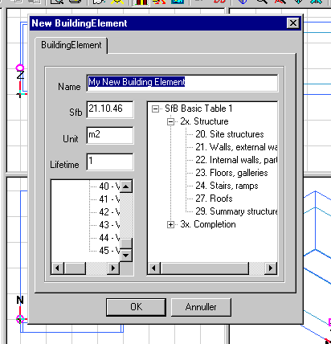

<link rel="stylesheet" href="../style.css">

# SimDb BuildingElement

BuildingElement optræder som første faneblad når der åbnes en indgang fra BuildingElement delen af databasen og når der oprettes et nyt bygningselement. Hvis fanebladet kaldes frem fra et eksisterende bygningselement i databasen, vil SfB feltet være inaktivt.

<figure id="center_img">

<figcaption>Oprettelse af et nyt bygningselement (New BuildingElement) i databasen.</figcaption>
</figure>

SfB-nummeret vælges via træ-oversigten i vinduet til højre i dialogen og indplaceres i en passende kategori. Informationen om den regningsmæssige enhed (*Unit*) og elementets forventede levetid (*Lifetime*) benyttes alene i forbindelse med LCA-analyser.
