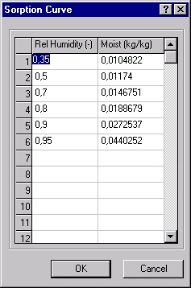

<link rel="stylesheet" href="../style.css">

# Sorption/desorption

<figure id="center_img">

<figcaption>Indlæsning af data for absorptionskurven.</figcaption>
</figure>

Absorption/Desorption

*   Indtast sammenhørende værdier af relativ fugt (-) og fugtindhold (kg/kg) for punkter på absorptions (desorptions) kurven for materialet. Første punkt antages altid at være (0, 0), og det kan udelades. Værdierne indtastes i rækkefølge med stigende relativ fugtighed.

DeltaRH

*   Indtast værdi(er) for materialets kurve for det hygroskopiske område, som sammenhørende værdier af relativ fugt (-) og fugt permeabilitet (kg/m s Pa).

 

DeltaU

*   Denne tabel anvendes ikke endnu.

*   *Typiske værdier for fugtmodstande (SBI-anvisning 178, Bygningers fugtisolering, 1993).*

| Byggemateriale                 | Fugtmodstand [m²sPa/kg] |
|--------------------------------|---------------------------|
| Tæppe med latexbagside    | 1 · 10⁹                   |
| Linoleum                   | 25 · 10⁹                  |
| Vindtæt asfaltpap          | 25 · 10⁹                  |
| Vinylgulvbelægning         | 100 · 10⁹                 |
| Polyethylenfolie           | 250 · 10⁹                 |
| Polyvinyliden (2 strygn.)  | 250 · 10⁹                 |
| Tagpap                     | 500 · 10⁹                 |
| Specialmembran             | 5000 · 10⁹                |
| **Maling mv.:**                |                           |
| Kalkning                       | 0,5 · 10⁹                 |
| Olieemulsionsmaling            | 0,5 · 10⁹                 |
| Cementpulvermaling             | 0,5 · 10⁹                 |
| Silikatmaling                  | 1 · 10⁹                   |
| Kunstgummifacademaling         | 1 · 10⁹                   |
| Plastmaling                    | 2,5 · 10⁹                 |
| Alkydoliemaling                | 15 · 10⁹                  |
| Chlorkautchukmaling            | 50 · 10⁹                  |
| Polyurethanlak                 | 50 · 10⁹                  |
