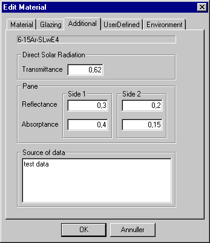

<link rel="stylesheet" href="../style.css">

# SimDb - Glazing, Additional data

På fanebladet *Additional* findes data som er nødvendige for at benytte den udvidede model for simulering af glastemperaturen. Denne model tage bedre hensyn til absorbtion af sol i glassene end den oprindelige model, som beregner glastemperaturen på baggrund af den mørke U-værdi.

<figure id="center_img">

<figcaption>Faneblad Additional for definition af inddata til detaljeret simulering af glastemperaturen.</figcaption>
</figure>

*   *Direct Solar Radiation*

    *   *Transmittance* er den direkte transmittans for solstråling vinkelret på glasset, dvs. uden det sekundære varmebidrag som opstår på grund af glassets opvarmning. Den direkte transmittans er mindre end *Heat Transmittance* (G-værdien) som er givet på *Glazing* fanebladet.

*   *Pane*

    *   *Reflectance* er reflektansen for glasset på side 1 hhv. side 2 i ruden. Side 1 er den side som vises øverst i træstrukturen for det aktuelle vindue, i ydervægge normalt indersiden. Kendes kun den samlede reflektans for alle glaslag i ruden kan denne værdi indsættes på *side 1* og BSim vil antage en ligelig fordeling på de to sider.

    *   Absorbtance er absorbtansen for for glasset på side 1 hhv. side 2 i ruden. I øvrigt behandles absorbtansen som nævnt for reflektansen.

*   *Source of Data* er et tekstfelt som giver mulighed for at beskrive hvorfra de givne data stammer som en dokumentation af beregningerne.

Algoritmerne for beregning af glastemperaruren kan ses i [Det matematiske grundlag](https://bsim.outseta.com/support/kb/articles/XQYdn7mP/beregning-af-glastemperatur).
