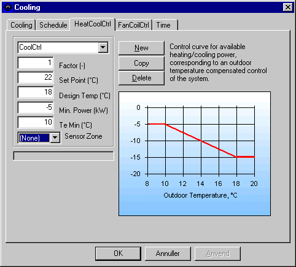

<link rel="stylesheet" href="../style.css">

# Cooling control

<figure id="center_img">

<figcaption>Definition af reguleringen (Cooling | HeatCoolCtrl) for en køleradiator.</figcaption>
</figure>

*Factor* angiver, at der inden for den tilknyttede tidsangivelse kun er en vis andel af den beregnede køleydelse til rådighed, bestemt ved den beregnede værdi gange *Factor*.

*Set Point* angiver det indstillede setpunkt for rumtermostaten i tilfælde af kølebehov.

*Design Temp* angiver den udetemperatur, ved hvilken køleradiatoren opnår sin maksimale ydelse, *Max Power*.

*Min Power* angiver den mindste effekt, der er til rådighed ved temperaturen *Te Min*, inden for de tidsangivelser, hvor køleradiatoren er aktiv. Det bemærkes, at radiatoren antages forsynet med en termostatreguleret ventil, som regulerer den faktisk afgivne køleeffekt efter det aktuelle behov.

*Te Min* angiver den udetemperatur, hvor den til rådighed værende køleydelse når sit minimum. Mellem *Te Min* og *Design Temp* reguleres den til rådighed værende køleeffekt lineært, mens den uden for dette interval er henholdsvis *Min Power* og *Max Power*. Effektafgivelsen er 0 uden for de definerede tidsangivelser.

*Sensor Zone* fortæller programmet i hvilken termisk zone temperaturføleren for køleanlægget er placeret. Vælger der (*None*) er svarer det til zonen selv, og systemet kan dermed kopieres/flyttes til en anden termisk zone uden ændringer.