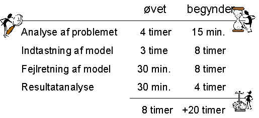

<link rel="stylesheet" href="../style.css">

# Tidsforbrug

Typisk tidsforbrug i forskellige faser af arbejdet med gennemførsel af en simulering af en bygning. Det reelle tidsforbrug varierer kraftigt afhængig af opgaven og kompleksiteten af modellen, men forholdet mellem tidsforbrugene er nogenlunde korrekt.

<figure id="center_img">

<figcaption></figcaption>
</figure>
