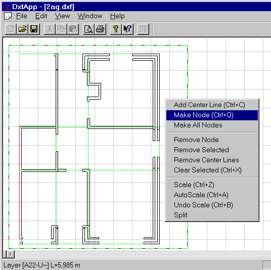

<link rel="stylesheet" href="../style.css">

# SimDXF - oprette hjælpelinier

I *SimDXF* vælges skæringspunkter mellem linier som grundlag for definition af knudepunkter i planen. På baggrund af hjælpelinierne og knudepunkterne dannes rum med en fast højde.

Følgende regler er gældende for manøvrering i *SimDXF*:

*   Linier/punkter (nodes) kan VÆLGES ved Ctrl+klik på linien (vises normalt blå)

*   Gentages klik, fjernes valget (on/off funktion)

*   Alternativt kan linier/punkter vælges ved at tegne et REKTANGEL (træk med venstre musetast nede) omkring de ønskede linier eller punkter

*   Valg af linier/punkter nulstilles med Ctrl+X.

Hele tegningen kan vises i vinduet (AutoScale = Ctrl+A), eller der kan zoomes ind på et markeret område af tegningen (tegn rektangel + Ctrl+Z).

Konstruer *hjælpelinier* for de ønskede vægge og konstruktioner.

 **For indervægge er hjælpelinien centerlinien (vælg yderlinierne + Ctrl+C), eller tegn et rektangel over linierne + Ctrl+C.** 

 **For ydervægge skal hjælpelinien være yderkanten mod det fri.** 

<figure id="center_img">

<figcaption>Hjælpelinier optegnet i DxfView.</figcaption>
</figure>

Se også:

*   [Vælg DXF-filter - Edit DXF-filter](https://help.bsim.dk/support/kb/articles/ZmNrexm2/simdxf---valg-dxf-filter)

*   [Hent DXF-fil - Open DXF-file](https://help.bsim.dk/support/kb/articles/BWzdblQE/simdxf---abne-dxf-tegning)

*   [Knudepunkter (nodes)](https://help.bsim.dk/support/kb/articles/XQYdOMmP/simdxf---oprette-knuder-nodes)

*   [Flade - Face](https://help.bsim.dk/support/kb/articles/4966zA9X/simdxf---flader)

*   [Rum - Room](https://help.bsim.dk/support/kb/articles/y9q8DNQA/simdxf---rum)

*   [WinDoor](https://help.bsim.dk/support/kb/articles/OW4N0pQg/simdxf---windoor)

*   [Tegningsrevisioner](https://help.bsim.dk/support/kb/articles/dQG2xem4/simdxf---tegningsrevisioner)

*   [Tilføjelse af SimDXF som applikation](https://help.bsim.dk/support/kb/articles/7maw2X9E/simdxf---tilfoje-som-applikation)