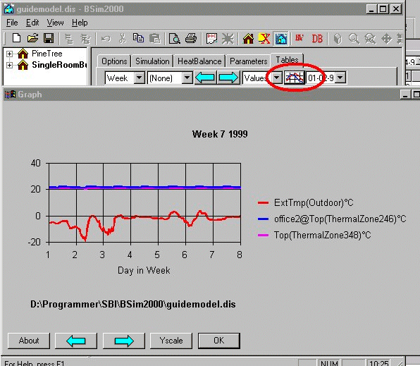

<link rel="stylesheet" href="../style.css">

# tsbi5 graf

<figure id="center_img">

<figcaption>Grafisk præsentation af timeværdierne.</figcaption>
</figure>

Modellens placering vises nederst på grafen. Tilhørsforholdet til de forskellige benyttede modeller ved modelsammenligning er vist som et foranstillet *modelnavn@* (som i figuren hvor resultater fra den aktuelle model *guidemodel* er sammenlignet med resultaterne fra *office2*) foran den enkelte parameter.

Det et muligt at fastlåse y-aksens maksimum og minimum værdier så akseinddelingerne ikke ændres fra den ene periode til den næste.

Dialogen for angivelse af y-aksens skala kaldes frem ved tryk på [Yscale-knappen](https://help.bsim.dk/support/kb/articles/wmjn7BmV/graph-scale).

Det er muligt at manipulere med den grafiske visning af timeværdierne som beskrevet i afsnittet [ændring af den grafiske afbildning af resultater](https://help.bsim.dk/support/kb/articles/aWxnxAQV/andring-af-den-grafiske-afbildning-af-resultater).