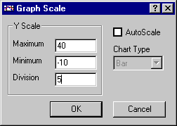

<link rel="stylesheet" href="../style.css">

# Graph Scale

<figure id="center_img">

<figcaption>Dialog for fastlåsning af y-aksens maksimum og minimum værdier fra periode til periode.</figcaption>
</figure>

*Minimum* angiver den mindste værdi på y-aksen og *Maksimum* den største. *Divisions* er afstanden mellem underinddelingerne på aksen. Med "check-mærket" *AutoScale* er det muligt at slå autoskaleringen til og fra.

I *Chart Type*, der kun kan vælges fra den grafiske visning af [varmebalancen](https://help.bsim.dk/support/kb/articles/wmjn57mV/tsbi5---heatbalance), er det muligt at vælge mellem 4 grafiktyper: stavdiagram (standard), lagkage set oppe fra, rumlig lagkage og rumlig krans. For de tre sidste typer gælder at varmetab angives ved sin numeriske værdi. Det samlede areal angiver således **både** varmetilskud (+) **og** varmetab (-).