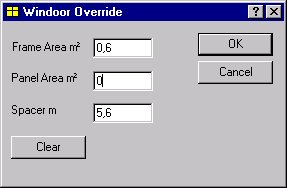

<link rel="stylesheet" href="../style.css">

# WinDoor Override

Fra databasen kendes glassets egenskaber, varmetabet gennem afstandsprofilet, rammens bredde og egenskaber samt egenskaber og størrelse for en eventuel fyldning.

<figure id="center_img">

<figcaption>Dialog (Windoor Override) til ændring af beregnede geometriske værdier for WinDoor.</figcaption>
</figure>

Alle felter kan nulstilles ved klik på *Clear*-knappen, hvorefter programmet foretager en ny arealberegning ud fra åbningens geometri og informationer fra databasen om rammetypen.

 