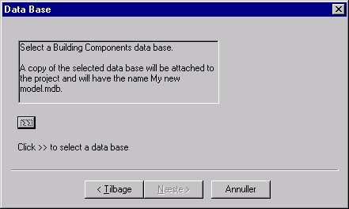
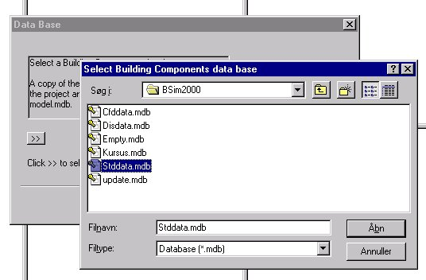

<link rel="stylesheet" href="../style.css">

# Projekt Wizard 2

Efter navngivning af projektet skal der vælges en database som udgangspunkt for modellens database. Der skal vælges en eksisterende database der kopieres som lokal database.

<figure id="center_img">

<figcaption>Valg af eksisterende database som grundlag for lokal database.</figcaption>
</figure>

Ved tryk på knappen med dobbelt-pilen ">>" åbnes en dialog til valg af eksisterende database der benyttes som udgangspunkt for projektet.

<figure id="center_img">

<figcaption>Databasen "SbiData.mdb" er den database som leveres med BSim og opdateres ved programopdateringer. "MoistDat.mdb" leveres sammen med BSim og indeholder futgttekniske egenskaber for materialerne i "SbiData.mdb".</figcaption>
</figure>

[Næste >](https://help.bsim.dk/support/kb/articles/BWzd0LQE/projekt-wizard-3) dialog i Wizard'en

