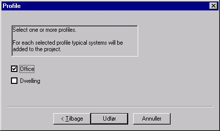

<link rel="stylesheet" href="../style.css">

# Projekt Wizard 3

Når databasen er valgt kan der vælges imellem forskellige typer af bygninger, fx kontorer (*Office*) eller lejligheder (*Dwelling*). Dette valg har betydning for de standardprofiler som automatisk vil optræde i modellen, fx døgnprofiler, tidsangivelser og visse belastninger.

<figure id="center_img">

<figcaption>Bygningstypen vælges og standardprofiler indsættes for brug i modellen.</figcaption>
</figure>

Nu er standarddata inkluderet i modellen og der kan [oprettes en bygning](https://help.bsim.dk/support/kb/articles/yW1x059B/simview---oprette-en-bygning).

