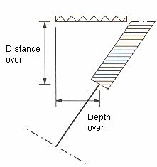
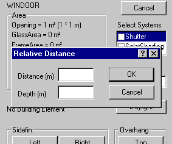

<link rel="stylesheet" href="../style.css">

# Udhæng og sidefinner

Dialogerne til definition af udhæng og sidefinner beskriver skyggegiveren relativt i forhold til vinduet ved anstanden fra glassets nærmeste kant og afstanden fra væggens yderside og frem til skyggegiverens forkant.

<figure id="center_img">

<figcaption>Definition af målangivelser for "overhæng" og "sidefinner".</figcaption>
</figure>

 

<figure id="center_img">

<figcaption>Definition af målangivelser for "overhæng" og "sidefinner" for skrå flader.</figcaption>
</figure>

 

<figure id="center_img">

<figcaption>Dialog (Relative Distance) til definition af lokale skyggegivere (sidefinner og udhæng) omkring et vindue. Skyggegiveren beskrives ved afstanden til glassets nærmeste kant (Distance) og afstanden fra væggens yderside til skyggegiverens forkant (Depth).</figcaption>
</figure>