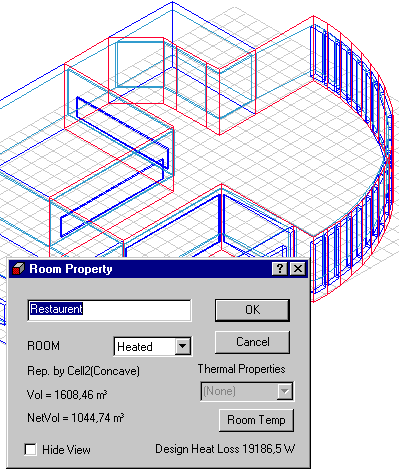

<link rel="stylesheet" href="../style.css">

# Room Propery

Dialogen for visning af egenskaberne for et rum åbnes ved at højre-klikke på rummet i træ-strukturen og vælge indgangen *Property*.

<figure id="center_img">

<figcaption>Room Property.</figcaption>
</figure>

*   *ROOM*: Beskriver for Be10 programmet hvilken temperatur rummet har.

*   *Rep. by* angiver hvilken celle som repræsenterer rummet samt om rummet er konvekst (Convex) eller konkavt (Concave). Det er ikke muligt at regne på dagslys eller langbølget strålingsudveksling i konkave rum - tsbi5 slår selv dette fra i denne type rum.

*   *Vol* = angiver cellens volumen inden for systemlinjerne.

*   *NetVol* = angiver cellens volumen inden for konstruktionerne (indvendige mål).

*  *Thermal Properties*: Beskriver de termiske egenskaber for rum placeret uden for termiske zoner. Kan benyttes til beskrivelse af fiktive zoner med regulering af indetemperaturen. Det er muligt at vælge at temperatur- og fugtforholdene i et rum til ethvert tidspunkt skal følge forholdene i en egentlig termisk zone eller udeklimaet.

*   *Room Temp*: Åbner en [dialog](https://help.bsim.dk/support/kb/articles/4966J79X/rumtemperatur) for definition af et rums (uden for termiske zoner) temperatur- og fugtvariation som en cosinus formet variation over året og dagen.

*   *Hide View*: Giver mulighed for at skjule geometriske visningen af det aktuelle rum - især nyttigt ved store modeller med mange rum.

*   Vises der et **stop-skilt** i dialogen betyder det at der er en fejl i beskrivelsen af geometrien for rummet. Normalt optræder dette som følge af ikke sammenfaldende hjørnepunkter mellem to flader som støder op til hinanden. Især i meget store modeller med mange rum som er helt eller delvist genereret ved import af DXF tegninger kan fænomenet optræde. Problemet vil ofte kunne afhjælpes ved at benytte menuindgangen *Edit* | *Clean* | *Geometry*.