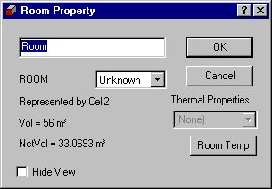
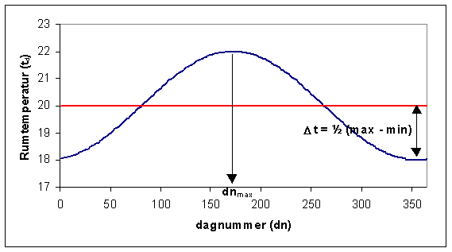
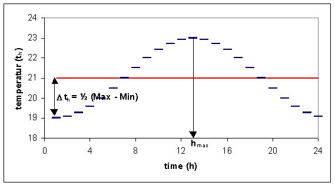

<link rel="stylesheet" href="../style.css">

# Rumtemperatur

Når der højre-klikkes på den fiktive zone (rum) åbnes vinduet for definition af rummets termiske egenskaber.

<figure id="center_img">

<figcaption>Rummets termiske egenskaber (Room Property) kan vælges som en termisk zone eller som et temperaturprofil ved tryk på Room Temp knappen.</figcaption>
</figure>

I valgmenuen ROOM kan rummets tilstand vælges (Unknown/Heated/Unheated). Valg af denne egenskab har **kun** betydning hvis modellen overføres til Be10-programmet for at gennemføre en energirammeberegning.

Hvis rummet altid skal have samme temperatur som en termisk zone, kan denne vælges i listen under Thermal Properties.

Temperaturvariationen i et rum uden for de termiske zone kan beskrives som en cosinus formet svingnig hen over året.

<figure id="center_img">

<figcaption>Dialogen RoomTemp giver mulighed for definition af et temperaturprofil for rum uden for termiske zoner. Disse kan opfattes som fiktive zoner.</figcaption>
</figure>

Årsvariationen af temperaturen i et rum beregnes som en middel døgntemperatur af:

$$  
t_d = t_0 + \Delta t \cdot \left( \cos\left(\left(\text{dn} - \text{dn}_{\text{max}}\right) \cdot \left(\frac{2\pi}{365}\right)\right)\right)
$$

hvor:

* t0 er årsmiddeltemperaturen,

* Δt er den halve forskel mellem maksimum og minimum temperaturen,

* dn er det aktuelle dagnummer,

* dnmax er nummeret på den dag hvor temperaturen når sit maksimum (fx. 21. juni = 172).

<figure id="center_img">

<figcaption>Årsvariationen af temperaturen i et rum. Års middeltemperaturen er 20 °C. Svingningen er på 4 °C (Maximum - Minimum) med sit maksimum den 21. juli (dagnummer 172).</figcaption>
</figure>

Som en variation på den beregnede døgntemperatur, kan der yderligere påtrykkes en variation over døgnet (ens for hver hele time):

$$  
t_h = t_d + \Delta t_h \cdot \left( \cos\left(\left(h - h_{\text{max}}\right) \cdot \left(\frac{\pi}{12}\right)\right)\right)  
$$

hvor: 

* td er den beregnede døgnmiddeltemperatur for det aktuelle døgn,

* Δth er den halve værdi af dagvariationen (Day Variation),

* h er den aktuelle time,

* hmax er timen hvor temperaturen når sit maksimum.

<figure id="center_img">

<figcaption>Døgnvariation af temperaturen i et rum med døgnmiddeltemperaturen 21 °C, med maksimumtemperatur i time 13 og en døgnvariation på 4 °C.</figcaption>
</figure>

Tilsvarende variation kan påtrykkes fugten i rummet.
