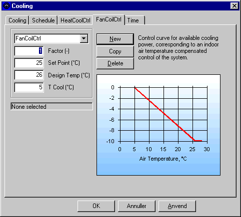

<link rel="stylesheet" href="../style.css">

# Fan coil regulering

Med *fan coil* *regulering* af kølingen i BSim er det muligt at tage hensyn til at effektafgivelsen er afhængig af temperaturdifferencen mellem kølefladen (kølemediet) og rumluften. Denne regulering svarer til den regulering som typisk benyttes i forbindelse med *fan* *coils* eller *kølebafler*.

Den køleeffekt som kan afsættes i den termiske zone er:

$$  
P = \frac{(\Theta_i - \Theta_m) \cdot P_{\text{dim}}}{\Theta_{\text{dim}} - \Theta_m}  
$$

hvor:

*   Θi er den termiske zones operative temperatur.

*   Θm er middeltemperaturen for kølemediet.

*   Pdim er den dimensionerende effekt for det lokale køleanlæg.

*   Θdim er den dimensionerende rumtemperatur for det lokale køleanlæg (den temperatur hvorover køleanlægget opnår sin dimensionerende effekt).

<figure id="center_img">

<figcaption>Dialog (Cooling | FanCoilCtrl) til regulering af køling som fan coil.</figcaption>
</figure>

<u>*Factor* </u>angiver, at der inden for den tilknyttede tidsangivelse kun er en vis andel af den beregnede køleydelse til rådighed, bestemt ved den beregnede værdi gange *Factor*.

<u>*Set Point*</u> angiver det indstillede setpunkt for rumtermostaten i tilfælde af kølebehov.

*Design Temp* angiver den zone-temperatur, ved hvilken køleradiatoren opnår sin maksimale ydelse, [*Max Power*](https://help.bsim.dk/support/kb/articles/y9gBNGQM/cooling-system).

*T Cool* angiver mideltemperaturen for kølemediet.

På grafen ses den til rådighed værende køleeffekt som en funktion af zonetemperaturen ved de givne inddata som for den aktuelle regulering. Det er kun på den del af kurven som ligger mellem Set Point og Design Temp (dvs. kun hvis kølekapaciteten ikke er tilstrækkelig til at holde indetemparaturen på det ønskede sætpunkt), at den muligt afstatte effekt fra Fan-coil'en reguleres efter hældningen på kurven.

Den afsatte effekt ved FanCoilCtrl i resultatloggen (qCooling) kan i visse tilfælde med meget varierende belastninger (også solindfald) vise en højere værdi end den som kan beregnes ud fra resultatloggens indetemperatur og de givne inddata. Det skyldes at den indetemperatur som vises i resultatloggen er den temperatur som er beregnes ved udgangen af det sidste tidsskridt i timen. Indetemperaturen kan være højere i de mellemliggende tidsskridt. qCooling beregnes i hvert tidsskridt i timen.

