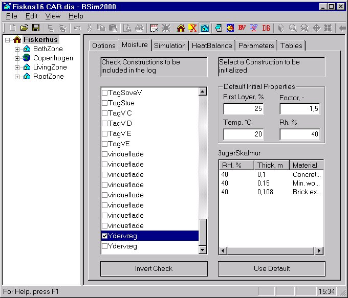

<link rel="stylesheet" href="../style.css">

# tsbi5 - Fugt

Fanebladet Moisture indeholder forskellige muligheder for at definere forudsætningerne for fugtberegningen af bygningens konstruktioner i den følgende simulering.

<figure id="center_img">

<figcaption>I fanebladet "Moisture" angives forudsætningerne for fugtberegningerne af bygningens konstruktioner.</figcaption>
</figure>

Til venstre vises en oversigt over alle bygningens konstruktioner, som findes i en termisk zone, og dermed indgår i fugtberegningen. Når en konstruktion vælges i oversigten vises denne konstruktion's lagdeling fra side 1 til side 2. For hvert lag vises lagets start relative fugtindhold (RH %), lagets tykkelse (m) og bygningsmaterialet. Et lag vil som standard have den relative fugtindhold, som er angivet ovenfor i *Default Initial Properties* Rh, %. Værdien kan ændres ved at klikke på det aktuelle lags RH, %, og indtaste - når feltet er indrammet - en ny værdi (heltal). De indtastede ændringer af relativ fugtindhold i forhold til standardværdien kan fortrydes ved klik på *Use Default* knappen.

For hver konstruktion i oversigten findes et afkrydsningsfelt, som angiver om den pågældende konstruktion medtages i simulerings-loggen på timebasis. For en afkrydset konstruktion medtages den relative fugt og absolutte fugtindhold gennem konstruktionens laginddelinger. **For at en konstruktions timeværdier gemmes forudsættes at Constructions under Save in Log er valgt i fanebladet Options.** Afkrydsningsfelterne for alle konstruktionerne kan inverteres ved at klikke på *Invert Check* boksen.

*Default Initial Properties* I denne gruppe af data angives dels hvorledes de enkelte konstruktioner automatisk skal underopdeles i kontrolvolumener under simuleringen, og dels konstruktionernes starttilstand.

For et konstruktionsmateriale, som vender mod et rum, kan der beregnes en teoretisk mindste tykkelse dt af det første kontrolvolumen. Tykkelsen af det første lag bliver den procentdel af dt, som er angivet i feltet *First Layer*. Tykkelsen af de følgende lag øges gradvis med en faktor indtil tykkelsen bliver *Layer thick* (m), som angivet under fanebladet *Options*. Denne faktor angives i feltet *Factor*, -.

Begyndelses temperaturen af alle konstruktioner angives i feltet *Temp*.

Begyndelses relativ fugtindhold angives i feltet *RH*, som anvendes for alle konstruktioner, med mindre andet er valgt, som beskrevet ovenfor.

  

Se også:

*   [Faneblad *Options*](https://help.bsim.dk/support/kb/articles/nmDBKR9y/tsbi5---options)

*   [Faneblad *Simulation*](https://help.bsim.dk/support/kb/articles/DQ2xjyWV/tsbi5---simulation)

*   [Faneblad *HeatBalance*](https://help.bsim.dk/support/kb/articles/wmjn57mV/tsbi5---heatbalance)

*   [Faneblad *Parametres*](https://help.bsim.dk/support/kb/articles/nmDBAR9y/tsbi5---parameters)

*   [Faneblad *Tables*](https://help.bsim.dk/support/kb/articles/BWzdLlQE/tsbi5---tables)
