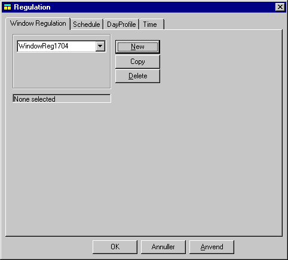

<link rel="stylesheet" href="../style.css">

# Regulation

Denne funktion er ikke i almindelig brug endnu, men er en forberedelse til simulering af naturlig ventilation i flere zoner.

 

Siden er under opbygning!  

 

 <figure id="center_img">

<figcaption>Dialog for definition af Windoor regulering for naturlig ventilation.</figcaption>
</figure>
