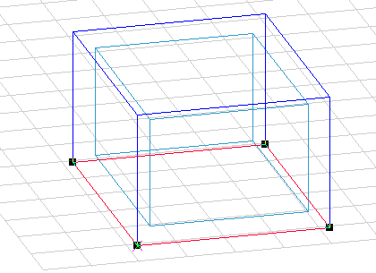

<link rel="stylesheet" href="../style.css">

# Kuldebroer

### **Geometriske kuldebroer**

Der er muligt at tage højde for det ekstra varmetab på grund af geometriske kuldebroer under simuleringerne med tsbi5.

De geometriske kuldebroer bliver håndteret i BSim, så beregningerne bliver gennemført i henhold til reglerne i DS418. Der indføres en justering af varmetabet gennem de indvendige arealer med forholdet mellem det indvendige og det udvendige areal af en flade.

<figure id="center_img">

<figcaption>Det indvendige areal er 6,4 m² imod et udvendigt areal på 11,2 m², hvilket giver anledning til en geometrisk kuldebro.</figcaption>
</figure>

Justeringen af varmetabet sker som en procentvis forøgelse af alle materialelags λ-værdier og varmekapacitet (r·Cp produktet). Beregningen af den justerede U-værdi på grund af geometriske kuldebroer sker på baggrund af delflader. Det har derfor stor betydning hvis en flade er opsplittet langs en kant og dermed har et relativt meget større udvendigt end indvendigt areal.

Eneste undtagelse, ifølge DS418, er samlingen mellem facade, gulv og fundament. Her sker beregningen af varmetabet som hidtil, gennem de indvendige mål. Kuldebroen i forbindelse med denne samling skal behandles som en [konstruktiv kuldebro](https://help.bsim.dk/support/kb/articles/NmdK5OW0/kuldebroer).