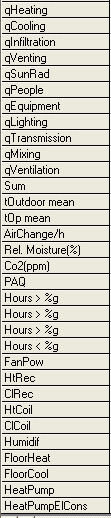

<link rel="stylesheet" href="../style.css">

# Parametre i varmebalancen

I varmebalancen findes en række parametre som oplyser om de forskellige energibidrag (kWh) - navngivet som qXxxxxxxx - til varmebalancen for bygningen eller de enkelte termiske zoner. Derudover findes en række parameter som er af almen interesse for indeklimaet.

*   *tOutdoor mean* er middelværdien (for den valgte tidsmæssige opløsning) af udeluftens temperatur.

*   *tOp mean* er middelværdien af den operative temperatur i bygningen eller den valgte termiske zone.

*   *AirChange* viser det gennemsnitlige luftskifte som luftskifter pr. time i bygningen eller zonen.

*   *Rel. Moisture* er den gennemsnitlige relative luftfugtighed som % relativ fugtighed i bygningen eller zonen.

*   *Co2* viser indholdet af CO2 i ppm i indeluften.

*   *PAQ* viser det beregnede [oplevede indeklima](https://help.bsim.dk/support/kb/articles/4966Zl9X/oplevet-indeluftkvalitet-paq).

*   *Hours > 21, Hour > 25, Hour > 28 og Hour < 20* viser antallet af timer med en operativ temperatur over hhv. under en given temperaturgrænse (grænsen kan ændres på [*Options* ](https://help.bsim.dk/support/kb/articles/nmDBKR9y/tsbi5---options)fanebladet) i den valgte termiske zone inden for den valgte opløsning på tidsskalaen, fx uge eller måned. Hvis hele modellen er valgt, vises ingen værdier for indetemperaturer over hhv. under temperaturgrænser.

*   *FanPow* viser den afsatte elektriske energi (kWh) i ventilatorerne i ventilationsanlæg (bygning/termisk zone). Effekten er beregnet på baggrund af den givne trykstigning (indblæsning og udsugning).

*   *HtRec* viser den energimængde (kWh) (varme) som er genvundet i varmeveksleren i ventilationsanlæg (bygning/termisk zone).

*   *ClRec* viser den energimængde (kWh) (køling) som er genvundet i kølegenvinderen i ventilationsanlæg (bygning/termisk zone).

*   *HtCoil* viser den energimængde (kWh) som er afsat i ventilationsanlæggenes varmeflade for at opvarme indblæsningsluften.

*   *ClCoil* viser den energimængde (kWh) som er afsat i ventilationsanlæggenes køleflade for at køle indblæsningsluften.

*   *Humidif* viser den energimængde (kWh) som er gået til et befugte luften i ventilationsanlæggene.

*   *FloorHeat* viser den mængde energi (kWh) som er afsat i konstruktionerne som gulvvarme.

*   *FloorCool* viser den mængde energi (kWh) som er afsat i konstruktionerne som gulvkøling.

*   *HeatPump* viser energitilskud (kWh) fra varmepumpe i zonen.

*   *HeatPumpElCons* viser elforbruget (kWh) til varmepumpen i zonen.

<figure id="center_img">

<figcaption></figcaption>
</figure>