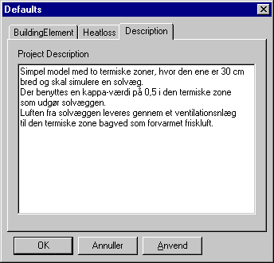

<link rel="stylesheet" href="../style.css">

# Beskrivelse

Fanebladet *Description* indeholder et tekstfelt som kan benyttes til at give egne oplysninger om modellen for eventuel senere brug.

<figure id="center_img">

<figcaption>Der kan indtastes en egen beskrivelse af særlige forhold om modellen i Defaults | Description.</figcaption>
</figure> 