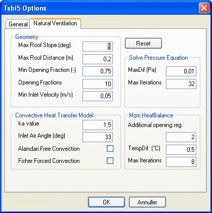

<link rel="stylesheet" href="../style.css">

# tsbi5 Natural Ventilation options

*Modulet til simulering af naturlig ventilation med multi-zone modellen (mzm) er i øjeblikket udsendt i beta-test og resultater opnået med modulet skal, som altid, betragtes med sund skepsis.*

*Feed-back til modulet på bsim-support@build.aau.dk er meget velkommen!*

 

Siden er under opbygning! 

**OBS:** Standardværdier bør **kun** ændres med stor forsigtighed! Når der klikkes "OK" gemmes de aktuelle værdier og benyttes i ALLE simuleringer indtil de ændres igen.

Fanebladet Natural Ventilation er reserveret særlige data i forbindelse med multizone (mzm) simulering af naturlig ventilation *([Venting](https://help.bsim.dk/support/kb/articles/gWKDJlmp/venting-system))* i BSim.

Reset

*   Ved klik på *Reset-knappen* skifter parametrene tilbede til standardværdierne som er indlejret i BSim.

<figure id="center_img">

<figcaption>Fanebladet Natural Ventilation under tsbi5 + Edit + Options.</figcaption>
</figure>

Geometry

*   *Max Ceiling Slope*: Maksimale hældning på indvendig side af loft for at modellen for natkøling kan benyttes.

*   *Max Ceiling Distance*: Maksimal afstand fra overkanten af åbning (Opening og WinDoor) til indvendig side af loft for at modellen for natkøling kan benyttes.

*   *Min Opening Fraction:* Angiver hvor stort et hul i en flade skal være i forhold til fladens areal for at fladen bliver ignoreret ved opstilling af *SuperFaces.*

*   *Min Inlet Velocity*: Minimums lufthastighed gennem åbningen for at modellen for natkøling kan benyttes.

Convective Heat Transfer Model

*   *ka value*: [Ka værdien](https://help.bsim.dk/support/kb/articles/DmwAjy94/parametre-til-naturlig-ventilation) for åbningen jf.[ Danvak Grundbogen, kapitel 7.](https://help.bsim.dk/support/kb/articles/A93zbqQ0/litteratur)

*   *Inlet Air Angle*: Luftstrålens breddevinkel.

*   *Alamdari Free Convection*: Model for fri konvektion.

*   *Fischer Forced Convection:* Model for tvungen konvektion.

Solve Pressure Equation - beskriver konvergenskriterierne for multizonemodellen.

*   MaxDif: En løsning antages for fundet når trykforskellen mellem to på hinanden følgende iterationer er mindre end angivet i inddatafeltet.

*   Max Iterations: Der kan maksimalt gennemføres det antal iterationer som er givet i feltet.

Mzm Heat Balance - beskriver konvergenskriterierne mellem multizonemodellen og den sædvanlige termiske simulering.

*   Additional opening reg.:

*   TempDif: En løsning antages for fundet når temperaturforskellen mellem to på hinanden følgende iterationer er mindre end angivet i inddatafeltet.

*   Max Iterations: Der kan maksimalt gennemføres det antal iterationer som er givet i feltet.

Se også: [Regulering af multizone modellen](https://help.bsim.dk/support/kb/articles/7mawyJ9E/regulering-af-multizone-modellen)
