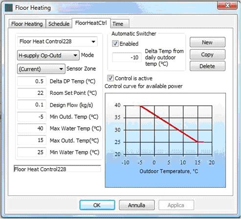

<link rel="stylesheet" href="../style.css">

# Control strategy for floor heating and cooling

### RADIANT HEATING/COOLING MODULE FOR BSim
   
By Massimiliano Scarpa

**OBS:**

*   Do **NOT** use the same floor heating control in more floor heating systems!

*   If you like to use the same control, make a copy and use that and select the face to host the floor heating system (use different names for faces in different thermal zones)!  

In the figure below an example of the window collecting the data about the system controls is shown.

<figure id="center_img">

<figcaption>Dialog for the input of system control strategies.</figcaption>
</figure>

Controls are defined as follows dependant on the selected **Mode** of operation:

All four control modes can be activated, just running at different times depending on the room conditions and the set-points. If more than one mode of operation is active for the same time definition, there is a risk that the *system will be commuting between e.g. a heating and a cooling mode - with the complications this may cause*.

To activate or deactivate a control mode:  
1) Select the control mode in the *Mode* drop-down menu;  
2) Click the field *Control is active* to activate or deactivate the selected control.  
3) Define the set-points for the actual control.  
*Heating Basic* will always be shown in the *Mode* drop-down menu when the dialog opens.

### **Cooling**

Available controls:

* Cooling Basic:

  * Sensor Zone [-]:* This field enables to set the thermal zone whose mean temperature is used by the system in order to define whether the cooling system has to run. The mean temperature of the sensor zone is compared with *"Room Set Point"*, and, consequently, it is defined whether the system must cool.

  * *Delta DP Temp* [°C]: It defines the temperature difference between the minimum water supply temperature and the dew point temperature inside the controlling zone, according with the following equation:

  $$
  \theta_{Water}^{Supply, Min} = \theta_{Zone}^{DewPoint} + \text{DeltaDPTemp}
  $$

  * *Room Set Point* [°C]: It is the maximum temperature to be kept in the sensor zone when the current control is acting.

  * *Design Flow* [kg/s]: It is the water mass flow to be used when the system is running in cooling mode.

  * *Min Outd. Temp* [°C]: Referring to the diagram in the figure above, it is the minimum outdoor temperature for the calculation of the water supply temperature. If the outdoor temperature is lower than "*Min Outd. Temp*", then "*Max Water Temp*" is kept as the water supply temperature.

  * *Max Water Temp* [°C]: Referring to the diagram in the figure, it is the maximum water supply temperature, defined at the minimum outdoor temperature allowed in the interpolation of the water supply temperature. If the outdoor temperature is lower than "*Min Outd. Temp*", then "*Max Water Temp*" is kept as the water supply temperature.

  *  *Max Outd. Temp* [°C]: Referring to the diagram in the figure, it is the maximum outdoor temperature for the calculation of the water supply temperature. If the outdoor temperature is higher than *"Max Outd. Temp"*, then *"Min Water Temp"* is kept as the water supply temperature.

  * *Min Water Temp* [°C]: Referring to the diagram, it is the minimum water supply temperature, defined at the maximum outdoor temperature allowed in the interpolation of the water supply temperature. If the outdoor temperature is higher than *"Max Outd. Temp"*, then *"Min Water Temp"* is kept as the water supply temperature.

  *   Automatic Switcher:

      *  *Enabled* [-]: If it is ticked, then the availability of the system for cooling is automatically defined. In particular, the system is available for cooling if the mean daily outdoor temperature is higher than Room Set Point + Delta Temp from Daily Outdoor Temp. For instance, let us consider:

          * Room Set Point: 26 °C  
          * Enabled: ticked  
          * Delta Temp from Daily Outdoor Temp: -6 °C  
          * Mean daily outdoor temperature: 19 °C  
    Since 19 < 26 - 6, then the system is considered not available for cooling.

          Instead, if:

          * Room Set Point: 26 °C  
          * Enabled: ticked  
          * Delta Temp from Daily Outdoor Temp: -6 °C  
          * Mean daily outdoor temperature: 21 °C  
    Since 21 > 26 - 6, then the system is considered available for cooling.

      * *Delta Temp from Daily Outdoor Temp* [°C]: It is the temperature difference between the mean outdoor temperature in the previous 24 hours and the set point temperature. It is set as a reference for the automatic switcher, as seen in the example above.

  * *Control is Active* [-]: It states whether the system is available in cooling mode. In a few words, it has to be ticked if the radiant system is connected to a chiller or to a free cooling system.

 ### **Heating**

Available controls:

* Heating Basic:

  *  *Sensor Zone* [-]: This field enables to set the thermal zone whose mean temperature is used by the system in order to define whether the heating system has to run. The mean temperature of the sensor zone is compared with *"Room Set Point"*, and, consequently, it is defined whether the system must heat.

  *  *Delta DP Temp* [°C]: It is not used in the present running mode.

  * *Room Set Point* [°C]: It is the minimum temperature to be kept in the sensor zone when the current control is acting.

  * *Design Flow* [kg/s]: It is the water mass flow to be used when the current control is acting.

  * *Min Outd. Temp* [°C]: Referring to the diagram, it is the minimum outdoor temperature for the calculation of the water supply temperature. If the outdoor temperature is lower than *"Min Outd. Temp"*, then "*Max Water Temp*" is kept as the water supply temperature.

  * *Max Water Temp* [°C]: Referring to the diagram, it is the maximum water supply temperature, defined at the minimum outdoor temperature allowed in the interpolation of the water supply temperature. If the outdoor temperature is lower than *"Min Outd. Temp"*, then *"Max Water Temp"* is kept as the water supply temperature.

  * *Max Outd. Temp* [°C]: Referring to the diagram, it is the maximum outdoor temperature for the calculation of the water supply temperature. If the outdoor temperature is higher than *"Max Outd. Temp"*, then *"Min Water Temp"* is kept as the water supply temperature.

  * *Min Water Temp* [°C]: Referring to the diagram, it is the minimum water supply temperature, defined at the maximum outdoor temperature allowed in the interpolation of the water supply temperature. If the outdoor temperature is higher than *"Max Outd. Temp"*, then *"Min Water Temp"* is kept as the water supply temperature.

  * Automatic Switcher:

    * *Enabled* [-]: If it is ticked, then the availability of the system for heating is automatically defined. In particular, the system is available for heating if the mean daily outdoor temperature is lower than Room Set Point + Delta Temp from Daily Outdoor Temp.  
  For instance, let us consider:

      * Room Set Point: 20 °C  
      * Enabled: ticked  
      * Delta Temp from Daily Outdoor Temp: -10 °C  
      * Mean daily outdoor temperature: 12 °C  
    Since 12 > 20 - 10, then the system is considered not available for heating.

        Instead, if:

      * Room Set Point: 20 °C  
      * Enabled: ticked  
      * Delta Temp from Daily Outdoor Temp: -10 °C  
      * Mean daily outdoor temperature: 8 °C  
    Since 8 < 20 - 10, then the system is considered available for heating.

    * *Delta Temp from Daily Outdoor Temp* [°C]: It is the temperature difference between the mean outdoor temperature in the previous 24 hours and the set point temperature. It is set as a reference for the automatic switcher, as seen in the example above.

    * *Control is Active* [-]: It states whether the system is available in heating mode. In a few words, it has to be ticked if the radiant system is connected to a boiler or a heat pump.

  *  H-Supply Op-Outd:

      * *Sensor Zone* [-]: This field enables to set the thermal zone whose mean temperature is used by the system in order to define whether the heating system has to run. The mean temperature of the sensor zone is compared with *"Room Set Point"*, and, consequently, it is defined whether the system must heat.

      * *Delta DP Temp* [°C]: It is not used in the present running mode.

      * *Room Set Point* [°C]: It is the minimum temperature to be kept in the sensor zone when the current control is acting.

      * *Design Flow* [kg/s]: It is the water mass flow to be used when the current control is acting.

      * *Min Outd. Temp* [°C]: It is not used in the present running mode, since the water supply temperature is set basing on the indoor operative and outdoor temperatures, according to the following equation:

        $$
        \theta_W = 0.52 \cdot (20 - \theta_{Ext}) + 20 - 1.6 \cdot (\theta_{Op} - 22)
        $$

      * *Min Water Temp* [°C]: It is not used in the present running mode.
      * *Max Water Temp* [°C]: It is not used in the present running mode.

      * *Max Outd. Temp* [°C]: It is not used in the present running mode.
   

  *   Automatic Switcher:
      
      * *Enabled* [-]: If it is ticked, then the availability of the system for heating is automatically defined. In particular, the system is available for heating if the mean daily outdoor temperature is lower than *Room Set Point + Delta Temp from Daily Outdoor Temp.*  
      
      * For instance, let us consider:

        * Room Set Point: 20 °C  
        * Enabled: ticked  
        * Delta Temp from Daily Outdoor Temp: -10 °C  
        * Mean daily outdoor temperature: 12 °C  
        * Since 12 > 20 - 10, then the system is considered not available for heating.

          Instead, if:

        * Room Set Point: 20 °C  
        * Enabled: ticked  
        * Delta Temp from Daily Outdoor Temp: -10 °C  
        * Mean daily outdoor temperature: 8 °C  
        Since 8 < 20 - 10, then the system is considered available for heating.

      * *Delta Temp from Daily Outdoor Temp* [°C]: It is the temperature difference between the mean outdoor temperature in the previous 24 hours and the set point temperature. It is set as a reference for the automatic switcher, as seen in the example above.

      * *Control is Active* [-]: It states whether the system is available in heating mode. In a few words, it has to be ticked if the radiant system is connected to a boiler or a heat pump.

  *  H-Av Op-Outd:

      * *Sensor Zone* [-]: This field enables to set the thermal zone whose mean temperature is used by the system in order to define whether the heating system has to run. The mean temperature of the sensor zone is compared with *"Room Set Point"*, and, consequently, it is defined whether the system must heat.

      * *Delta DP Temp* [°C]: It is not used in the present running mode.

      * *Room Set Point* [°C]: It is the minimum temperature to be kept in the sensor zone when the current control is acting.

      * *Design Flow* [kg/s]: It is the water mass flow to be used when the current control is acting.

      * *Min Outd. Temp* [°C]: It is not used in the present running mode, since the water supply temperature is set basing on the indoor operative and outdoor temperatures, according to the following equation:

        $$
        \theta_W = 0.52 \cdot (20 - \theta_{Ext}) + 20 - 1.6 \cdot (\theta_{Op} - 22) + \frac{Q_{PL}}{2 \cdot \dot m_W \cdot C_{pw}} 
        $$

        where QPL is the heat transfer rate taking place between the pipe and the slab (higher than zero in the heating case) in the previous time step.

      * *Max Water Temp* [°C]: It is not used in the present running mode.

      * *Max Outd. Temp* [°C]: It is not used in the present running mode.

      * *Min Water Temp* [°C]: It is not used in the present running mode.

    * Automatic Switcher:

        * *Enabled [-]:* If it is ticked, then the availability of the system for heating is automatically defined. In particular, the system is available for heating if the mean daily outdoor temperature is lower than *Room Set Point + Delta Temp from Daily Outdoor Temp.*  
        * For instance, let us consider:

            * Room Set Point: 20 °C  
            * Enabled: ticked  
            * Delta Temp from Daily Outdoor Temp: -10 °C  
            * Mean daily outdoor temperature: 12 °C  
                Since 12 > 20 - 10, then the system is considered not available for heating.

            Instead, if:

            * Room Set Point: 20 °C  
            * Enabled: ticked  
            * Delta Temp from Daily Outdoor Temp: -10 °C  
            * Mean daily outdoor temperature: 8 °C  
                Since 8 < 20 - 10, then the system is considered available for heating.

        - *Delta Temp from Daily Outdoor Temp* [°C]: It is the temperature difference between the mean outdoor temperature in the previous 24 hours and the set point temperature. It is set as a reference for the automatic switcher, as seen in the example above.

    - *Control is Active* [-]: It states whether the system is available in heating mode. In a few words, it has to be ticked if the radiant system is connected to a boiler or a heat pump.

 

See also the [mathematical basic for the system.](https://help.bsim.dk/support/kb/articles/VmAOro9a/regulering-af-gulv)
